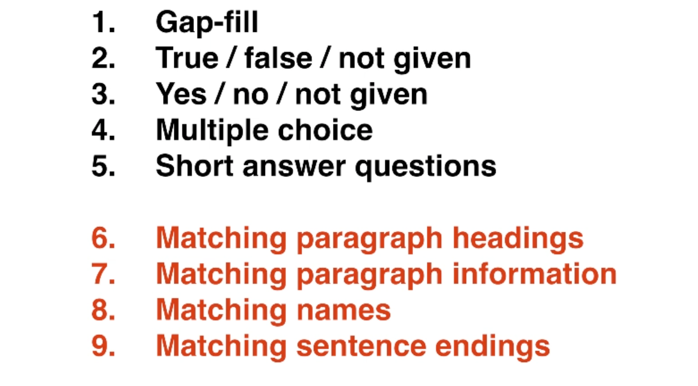

## Reading summary

**IELTS reading is a vocabular test.**

**最有效的是keywords**

- 每篇文章20分钟, 慢慢来, 不要太快忽略文章.

- 大量练习: slowly and carefully

  **high score first, faster later**

### 1. keyworkd technique

在题目中找keyword, 在段落中寻找.

### 2. vocabulary : 词汇量

每次练习把key vocabulary写下来.

### 3. Question types: 

前四种用keyword比较好.

### 4. time: 注意时间

- 正常速度读就好
- 练好"keyword-technique"
- 跳过难题
- 每篇文章20min, 练好时间. 
- **more practice**: 先练作对, 再练时间.

## Reading 01

**阅读是:**

1. 词汇量测试, 词汇的理解.

 

## Reading 02: 基础考试技巧, Gap-fill 问题

### 基础技巧:

1. 先不要读, 看完标题, 看第一个问题.
2. 在问题里画出"keywords", 在整个文章中找keyword, 仔细阅读相关的内容. 

3. 正常的速度读, 不要掠过.
4. 难题跳过.

1. 从文中选词
2. 在图中标记
3. 从list中选词

- **从文中一般按顺序**

## Reading 02: True/False/NotGiven 问题

**技巧:** 

1. 先看题目
2. 回文章找关键词
3. 答案在文章中是按照题目顺序的.

True-false-notGiven 和 yes-no-notGiven 问题区别

1. 关于事实的
2. 关于作者观点的
3. 做题没有区别.

## Reading 03: Matching paragraph headings 总结段落标题

**答案在文中是乱序的.**

**技巧:** 

1. 最后做这种题目
2. 画关键词
3. **先选择最简单/最短的段落**, 和所有的答案对比, 选择最好的.

| Keyword in paragraph |  keyworkd in question |

## Reading 4. `Which paragraph contains'` 问题

**答案在文中乱序, 一段有可能有多个答案**

**技巧:**

1. 最后做这种题目, 先熟悉文章.
2. 在文中划关键词
3. **先选最简单的段落做.**
4. 不太建议scaning, 会漏掉关键词, 划关键词.

| Keyword in paragraph |  keyworkd in question |

## Reading 05. multiple choice 多选题

**答案在文章中顺序的**

**技巧:** 还是keywords 

1.  在题目中寻找关键词, **选项中也要划**
2. 慢慢读文章, 寻找关键词匹配.

## Reading 06 matching names 匹配

**答案是乱序的, name匹配次数不确定**

**技巧:** 还是keywords

1. 划线每一个statement.
2. 在文中迅速查找所有的name. 画圈. 
3. 选择最简单的name, 最少信息的, 查看周围的信息.
4. 对比所有的question statement. 看看最合适的.

## Reading 07 Short answer: 

**技巧** 还是keywords技巧

1. 划线题目中的keyword
2. 在文中找keywords

## Reading 08 Matching sentence endings

**技巧:** 还是keywords技巧

