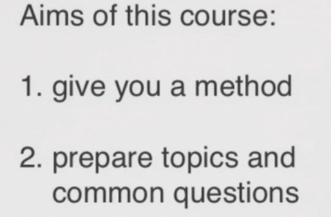
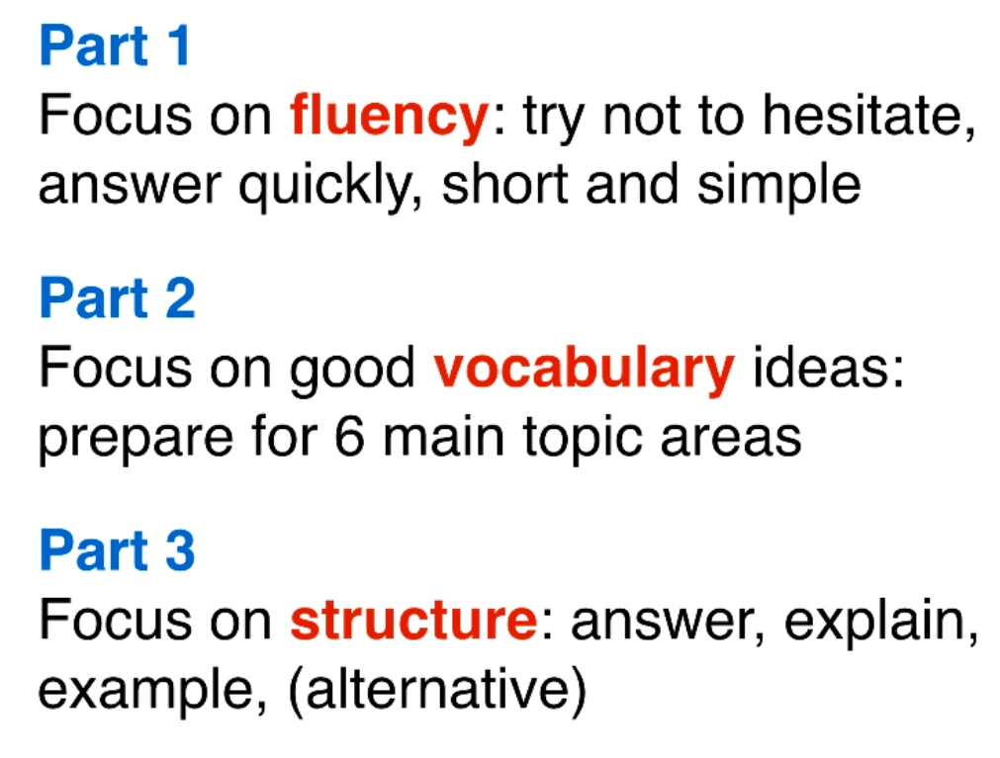

- 题型

11-14分钟. 时间很紧.

1. 4-5min
2. 3-4min
3. 4-5min

- 打分系统

1. fluency and coherence
2. Vocabulatry
3. Grammar
4. Pronunciation: clearly程度, 不是口音.

- 技巧

1. know what to expect:了解想要什么
2. natural language, 不是 difficult language. 尽量快回答, 想到了就说.

Part1 quick, part3 step-by-step.

只有part2可以思考, 还需要vocabulary和ideas.

## Part1: 

4-5分钟, 10个问题. **short-fast-easy的问题**.

- 尽量展示流畅度, 不要停顿
- 不要担心词汇和语法. 直接说, don't worry about the quality, just say something.
- 最重要的是 **Shot-simple answer**

**技巧:** 

- full sentences的short answer, 然后给理由.
- 回答完后 **Stop with confidence**, 表示自己ready for next question.

**话题:**

1. 比较简单的,

- do you like xxx?

2. 关于一个topic的4个问题

3. 关于一个topic的4个问题

## part2-1: good  Idea and Vocabularies

> - practise
> - Record 录下来
> - Write it down, imporve, keep going.

- 3-4 minutes, 1min prepare, speak for 2 minus. 给一个task card

1. 1分钟先记一下: quick decision
2. 接下来follow the points on the task card.

**备战准备**

1. Prepare for common topic areas

2. **Vocabulary and Idea** are the key.

   content is much more important than Grammer 

**Topics, techniques, vocabulary, example questions.**

**准备常见Topics:**

1. **Describe** a person

   1. 准备"**ideas**(角度)" 和 "vocabulary"
   2. Not grammar or linking.
   3. Speak naturally, explain in detail. 自信一点别太模式化.

   example: 

   - who, what he does
   - ....

   **Tips:**

   1. Think a **theme** for any person.... Hard-working...friendly....
   2. start with **easy adjectives**形容词: busy, active
   3. **better words** and phrases 进阶词汇: enthusiastic
   4. 找一个**example/store to demonstrate the theme**.

2. **Describe  a place**

Good idea, good vocabulary.

3. **Describe an object**

4. **Describe an event**
5. **Describe an activity**
6. **Describe your favourite**

## Part2-2 通用思路: generic procedure

1. adapt ideas from 6 main topics
2. **talk about your job or studies**
   1. Prepare **some good ideas and vocabulary** for job&studies.
3. 

## Part3

get 3- 6questions. give long detailed answers.

- 需要good explanation, good vocabulary, quit long answer.
- 不要repeat.

1. **answer structure, long answer.**
2. grammer: not making mistake.

**三步:**

1. Answer the question directly.

2. Explain your reasions.

3. Give an example.

4. Explain the opposit/alternative(代替)

   What would happen if ....

