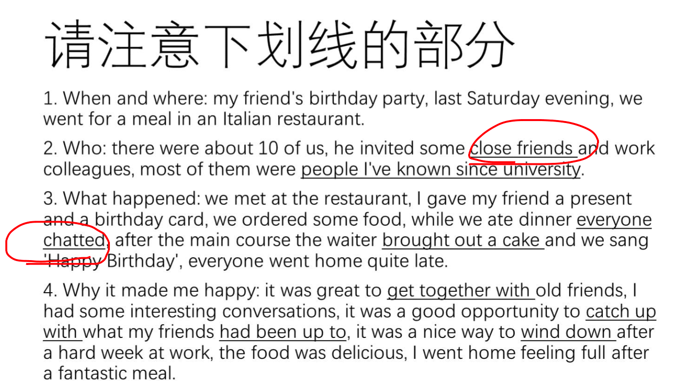
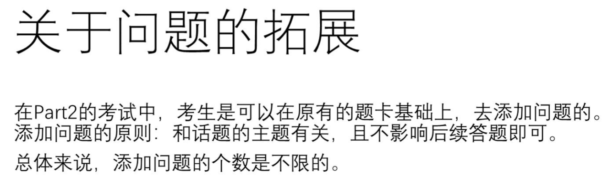
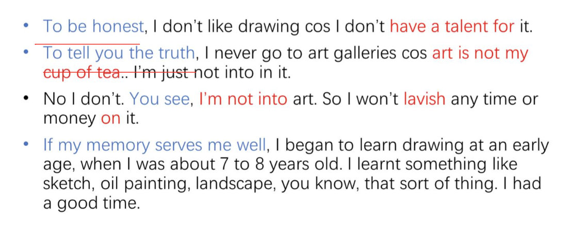
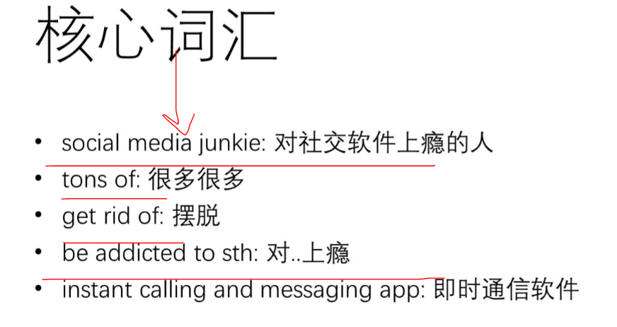
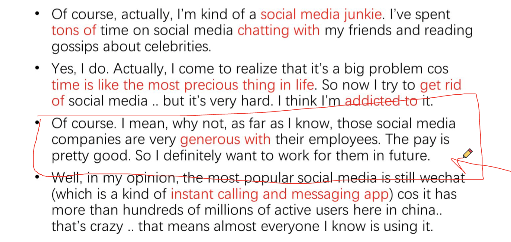
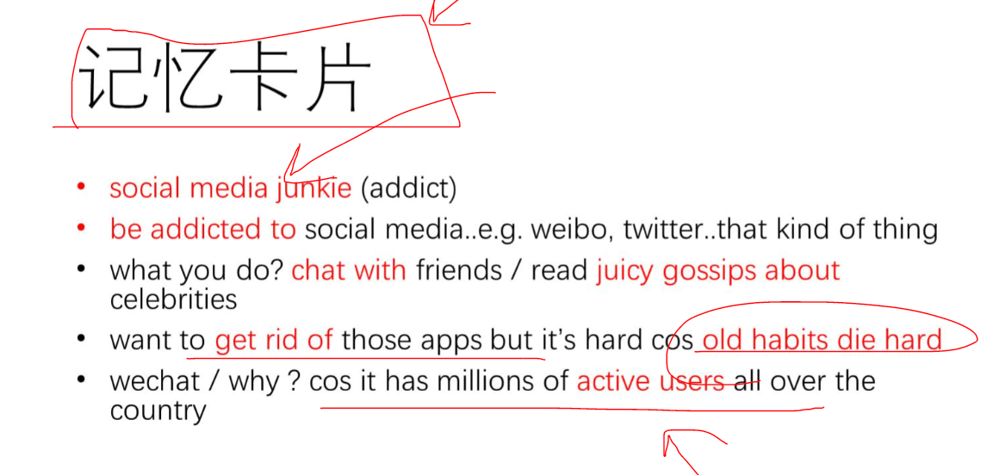
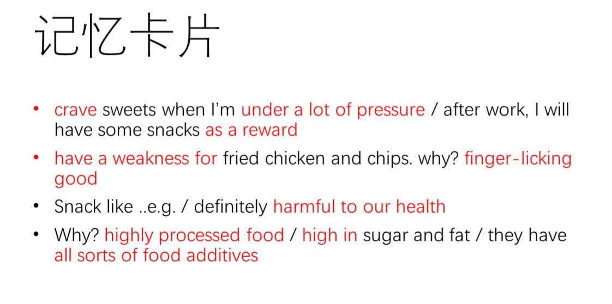
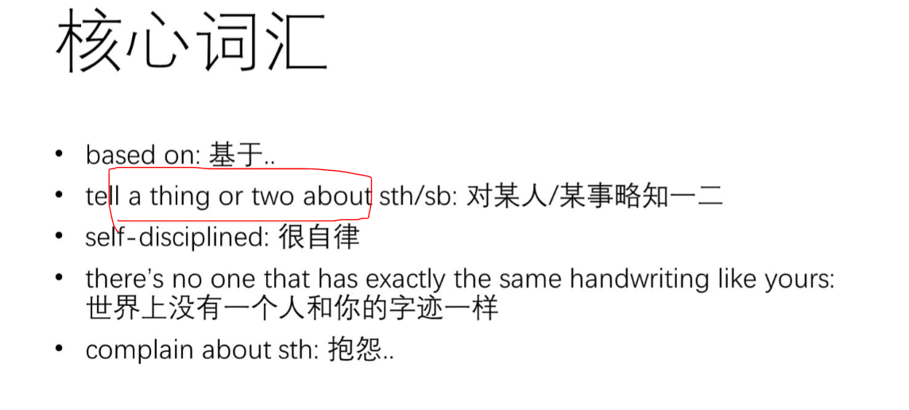

## Part 1 - introduction 自己

模板: 


## Part 2 - 课程

1. 不是讲故事, 而是回答问题
2. 按照问题的顺序, 整理思路, 每段一个主要问题, 说出来.
3. **答题机制: 可以添加和主题相关的问题, 任意.**
   - **会举例**很重要

**用词难度:** 有一个大纲(todo 下去找找)



1. 口语化
2. 词组




**常用词汇**


**问题条理:** 切入点

- to start with 

  also

  besides

- apart from that,
- Actually, there's another reason.
- 少用书面: in addition.

没有讲完没有关系, 已经探测好了.


**合并话题** 超过60%, 不可以硬套.**开头必须要改**

- describe a friend you like to talk with xxxx.
- describe a person you would like to spend time with 
- describe an interesting neighbor 

1. 制作属于自己的话题卡片 (**Discuss/discourse marker|* todo自己制作**)

   **who he is.**

   1. 核心词汇: 

      we have a lot of things in common.

      Die-hard fan

      easy to get on with

      have a good sense of humor

      Full of positive energy.

   2. 练习组合句子, 说出来.

   **how you got to know him?**

   1. 核心词汇: 

      if my memory serves me well, we first got to know each other at a party, 

      that kind of thing

      have a lot in common

   2. **直接举例子, 不要讲why**

   **what you usually do together?**

   1. 准备很多可以聊的点: 有趣, common hobbit 


casually, 不要求一样.


**<todo: 当季话题>**

**习语 是什么?**


## Part1 课程

part1涉及到各个方面

1. 时长5min, 10个问题
2. 不是越长越好, 2-3句话. 不要很长时间.
   1. 还是有一定的从句的使用, 解释一下.
3. quick response, 不要卡顿. 
4. 不需要每个问题做分类讨论. 

**答题原则: ** 

1. keep answer short, stop with confidence.
2. 用full sentence回答.
3. 如果可以, 给一个reason. answer+reason的形式.
4. 

**遇到不熟悉的问题:**

1. 没有难题. 主要是simple answer, answer+reason

**高分关键点:**

1. Topic specific vocabulary: 
2. Collocation: 固定搭配, **词组**
3. Less common expresson
4. Slang and Proverb

**TODO**

1. 准备口语词组

2. 准备discourse marker

3. **注意时态**

   

```txt
actually, no, i don't .. cos i can't bear that kind of the work pressure... it's said that those who working for those social media companies work around the clock everyday .. that will drive me crazy .. i do care about the work-life balance.
主讲nick：2. as far as i know those v-loggers can make millions a year.. that's amazing.. so if there's a chance to do it, i definitely will give it a try. i mean, why not.,
```



把核心词汇串联.



**制作记忆卡片:**







- 主要是一些discourse markers, 然后自己可以插足一些灵活空间吧.


## day4-前考官口语策略. 

人给出的分数是有误差的, 0.5分ok.

- **body language, confidence和口语一样重要.**
  - impression: confidence, easily, clearly across different topics.
  - 不会数着你的闪光点.

- **Memorise**

  不要像是背书一样. completely ruin 

- plat, more risome, 中文发音太平, 要有重音.

  - **clearly:** important word should be **strong!!!**, main point

  - **nature:**  需要不断地practice.找一些例子, 阅读, record, practice.

  - **Answer the question:** 

    - Part1: yes, absolutely. xxx

    - content comes first, 要有内容的框架. **观点展开清晰.** puting more details about that

      不要repeat too frequency.

    - 要有detail, 增加detail

  - 把考试看成job interview, sell yourself to the examiner. 

    表现好一点.

    - 看着面试官

**考试建议:**

1. 想想再说: 有content, 有idea, develop them, adding detail.

2. 学习natural language 的表达方式, 

   1. 换换单词,  practice.

3. pronunciation发音, stress重音, chunking 词组

   1. 不要老用 and, because. 
   2. speak in short section.

4. **body language:confidence.**

   Move forward, 手势, be involved.

   快说不出来的时候, 就马上stop就行, 不要stop hesitating. 可以说"that it, that all", 不要想着弥补.

   可以说"I forget what I'm going to say", 比什么也不说好.

**要重复, 听自己的, 修改, 重复.** 不能按照老的错误的


