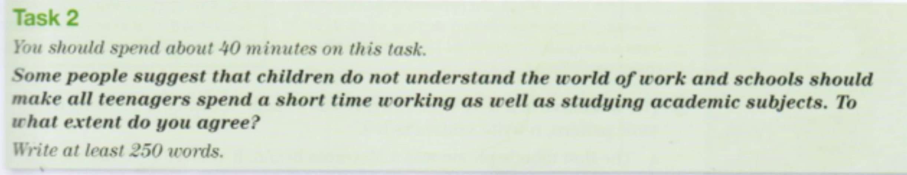

You work for an international company, and would like to spend six months working in its head office in another country.

Write a letter to your manager. In your letter

•  explain why you want to work in the company's head office for six months

•  say how your work could be done while you are away

•  ask for his/her help in arranging it

I work for international company -> go to head office for 6 months

Manager:

- Why I want to 
- how my work transfer to others
- Ask for help to arrange it

Dear Demon,

I heard that our firm provided some positions for experienced workers to transfer to the head office in Japan, and I want to apply for this opportunity.

// why I want to :

// 1. I am an experienced: qualified

// 2. learn some 

I want to apply this job because I need to learn some advance knowledges from the QA experts, and I'm qualified for this appliement with 4 years working experiment at QA department. After this program, I'm plaining to start a QA technologies sharing in my department to make a train and prevent some common mistakes.

// how my work: 

Currently, my job duties consist of 2 parts. The first job is performing daily checklist. Since this job has a clear construction, so I can transfer this to our new collegue, Li Yang. The second job needs to deal with some emergencies occured during the running of our programs. It needs some experience and practice, so I will transfer this to my best partner, Li Qiang, and I will continue assist with him.

// help me arrange this.

For those facts above, I need some help from you to start this applyment for me, and I will keep focusing on the follow steps. 

Thanks for you help, and I am looking forward to hearing from you.

**问题:** 

continue to do

assist sb

knowledge 不可数

apply -> application

at **the** QA department / **a** daily checklist: 冠词, 一定要加a, the

**收货:**

一定要多写一点字.

Children -> not understand the world: work&school  -> school should make all teenagers prepare/take a internship -> work & study

In modern times, there are more and more kinds of jobs for us, and even adults couldn't fully get every details of jobs. So some people suggest that young students should take some internships to work and study at the same time. I agree with this view in some aspects.

every detail

