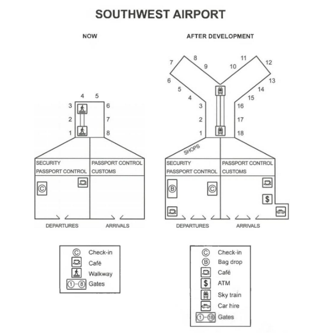

**The plans below show the site of an airport now and how it will look after redevelopment next year.**

*Summarise the information by selecting and reporting the main features, and make comparisons where relevant.*

Write at least 150 words.



site of an airport -> redevelopment next year

summarise Information -> 

- main features
  - 选择特点
  - 总结这些特点
- relevant comparisons
  - 

- 主要特点:
  - larger / explore / expend
  - more facilities


// introduction: 复述图表是关于什么的

this picture shows the next year's redevelopment plan for the Sourthwest Airport and some new facilities and new areas will be introduced into this site.

// overview: 2 sentense

Comparing to current site, the new site will contains more kinds of facilities to make passengers more comfortable. Since the growth of concurrency need to be satisfied, the airport site will build more gates.

// detail1: more facilities 

The old departures and arrivals only provide basic facilities and some facilities and changes will bring to the rooms. New bagdrop and new gates will be created in the departures and car hire and ATM will bring into the arrivals, so the passengers can take their time to start or end their trip. What's more, some new shops will open in the area behind the security passport control and the passengers can buy some tax free products.

// details2: expand.

The new airport will expend it's airplain gates from eight to eighteen. First, the layout of airplane gates will be Y model rather than I model, so more gates can be in the same spot. Second, the walkway will be replaced by the sky train, so the passengers can easily get to the target gate.


**错误:**

for Sourthwest Airport  不用加the

will be brought to 

Airplane


被代替/取代: replace


## 改后的

```text
This picture shows next year's redevelopment plan for Sourthwest Airport and some useful facilities and modern areas will be introduced into this site.

Compared to the current site, the new site will contain more kinds of facilities to make passengers more comfortable. Since the growth of concurrency needs to be satisfied, the airport site will build more gates.

The old departures and arrivals only provide basic facilities and some facilities and changes will be brought to the rooms. New bagdrop and new gates will be created in the departures and car hire and ATM will bring into the arrivals, so the passengers can take their time to start or end their trip. What's more, some new shops will open in the area behind the security passport control and the passengers can buy some tax free products.

The new airport will expand its airplane gates from eight to eighteen. First, the layout of airplane gates will be Y model rather than I model, so more gates can be in the same spot. Second, the walkway will be replaced by the sky train, so the passengers can easily get to the target gate.
```


## 范文

**// introduction: 转述的很漂亮**

The diagrams **portray** what the Southwest airport looks like now **as well as** what the same place would be like a year later when the renovation works would be complete.

// overview: 

**// 主要写了2个, be expended, 和 more facilities**

Overall, the Southwest **airport will be expanded**, and it will offer far more facilities and better accessibility for passengers after the development work is done.

// Detail1: 

As the illustration suggests, the airport **now has a single arrival and departure area**. The departure area is on the left of the building and has a cafe, while the arrival area does not have such amenities. Straight ahead of the arrival area, customs and passport control could be seen. Similarly, passport control and security are located for departing passengers. The airport now has eight gates, two walkways, and check-in areas.

**After the development work**, which is expected to be done next year, the airport will have eighteen gates, and a sky train inside the airport. New shops will be built, and the departing passengers will have access to bag drop facilities. It will be built where the check-in point is now. Opposite it, there will be the check-in point. The renovated airport will have more departure and entry points to serve more passengers at a time. It will also have ATMs and cafes for passengers in the arrival area. Finally, a car hire facility would also be included on the right-side of the arrival hall.


