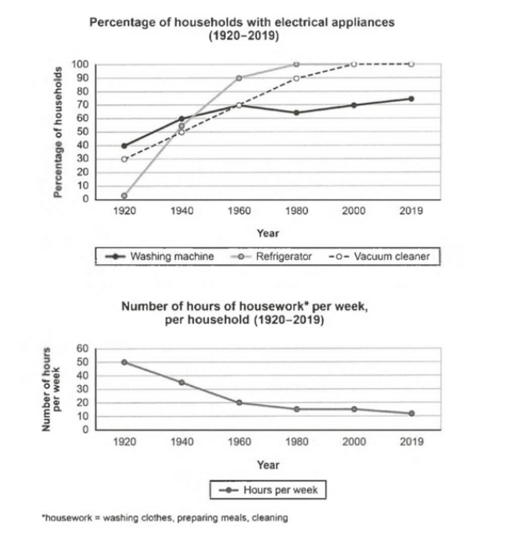

The charts below show the changes in ownership of electrical appliances and amount of time spent doing housework in households in **one country** between 1920 and 2019. 

Summarise the information by selecting and reporting the main features, and make comparisons where relevant. 



**问题:**

ownership of electrical appliances/equipment -> housework consuming time 
households 1920 -> 2019

main features
compare -> relevant points


// introduction

This two diagrams are trying to illustrate the relationship between the popularity of electrical equipment in households and the time spended on house work every family over time.

// overall

In general, all kinds of electrical appliances are more common in the 20th centery and the time housework comsuming is much lower. In addition, some housework appliances are initial quipment that all families own them, but others are not.

// detail1: 

From 1920 to 2019, all electrical appliances percentages are growning a lot, because people get richer and modern technique keeps being more advance. Since the contribution of new technologies applied to plenty of families, each family spend much less time on housework from 50 hours to 10 hours.

// detail2: different kinds of appliance

The popularity of different kinds of housekeeping appliances are various. Washing machine grows the slowest and it even drop some percentages in 1970s. What's more, Refrigerator and vacuum cleaner are owned by every family in the end, but more than 20% families still don't occupy washing maching and I think it may because that there are lots of laundrys.


**问题:**

these two

spend -> 被动: spent -> 单数 spends

century

Growing 

Modern techniques

is advanced

dropped

in the 1970s.

 20% of families

may be because

Laundry 不可数.


laundry: 洗衣服

Much -> extraordinary -> considerably -> greatly


**需要多一点数据**

## 优化后

```text

These two diagrams are trying to illustrate the relationship between the popularity of electrical equipment in households and the time spent on housework every family over the time.

In general, all kinds of electrical appliances are more common in the 20th century and the time housework comsuming is much lower. In addition, some housework appliances are initial equipment that all families own, but others are not.

From 1920 to 2019, all electrical appliances percentages are growing a lot, because people get richer and modern techniques keep being more advanced. Since the contribution of new technologies is applied to plenty of families, each family spends much less time on housework, from 50 hours to ten hours.

The popularity of different kinds of housekeeping appliances is various.  The washing machine grew the slowest and it even dropped some percentages in the 1970s. What's more, refrigerators and vacuum cleaners are owned by every family in the end, but more than 20% of families still don't occupy washing machines and I think it may be because there is plenty of laundry.
```


## 范文

> the percentages of households in one centry

连句: **the first graph displays** the xxxx, **while the second** graph illustrates

In comparitions,

As a general trend, 

```text
The first line graph outlines how the electrical appliance ownership in households in a country transformed during a century commencing from 1920 while the second chart delineates how it had affected the time spent on household work per week by the citizens in this country.

As a general trend, with the increasing number of electrical devices possessed by families, their need for doing housework significantly declined.

As the graph reveals, only 30 percent of households in this country used to have vacuum cleaners and four out of ten families had washing machines in 1920. Refrigerators were a rare electric appliance at that time.   Just after two decades, however, refrigerator possessions shoot up, and almost half of the families owned these three electric items in their homes. More families started to own such devices and at the beginning of the twenty-first century, almost all households had fridges and vacuum cleaners. The washing machine was owned by more than 70% of families which slowly but steadily increased till 2019. At that point, there was hardly any family without a refrigerator or vacuum cleaner.

It is interesting to note that, with the increasing number of electric appliances owned by families, their need for doing household work like preparing meals, cleaning and washing clothes remarkably diminished. While they used to work for 50 hours a week doing such work in 1920, it decreased to 20 hours in 1960 and 10 in 2019.

```


