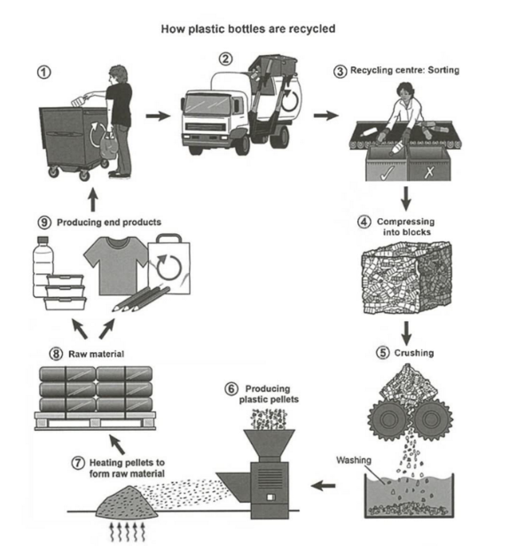

***The diagram below shows the process for recycling plastic bottles.*** 

*Summarise the information by selecting and reporting the main features, and make comparisons where relevant. 
Write at least 150 words.*



process : **recycling plastic bottles**


**Main features**

collection -> transport -> sorting compressing to blocks -> 


crushing flaps 

-> platics pellets heating to raw -> 

Raw meteral reproduct -> 

**comparisons**


***The diagram below shows the process for recycling plastic bottles.*** 


// introduction

This graph illustrate three main parts of the cycle of plastic bottles recyclings and it consists of nine details. 

// overview:

In general, the procedure start from collect and preprocessing bottles, then using the bottles to fabricate raw meterials. Finally, the meterials can be made for some new merchandises and we can get the 'bottles' again.

// details 1:

Starting from collecting bottles from every dustbin, the bottles are transported into Recycling Factory and the workers will sort all the plastic bottles into the next step. All plastic bottles are pressed into huge blocks, so they can be easily transport or produce.

// details2 下一步()

Next, the plastic blocks will be crushed into flap and throwed into walter for washing, then using the machine to product clean plastics pellets. The pellets are heating up, so they can turn to raw meterals for merchandises and those new products can be send to customers after the raw meterials beeing reproducted.


**错误:**

the procedure **starts** from  用单数

collecting 要用这种动名词.

material

merchandise 不可数

the Recycling Factory 这种name, 要加**the**

piece 片.

throw -> 被动: thrown

Send -> 被动: sent

Water: 水

produce 动词生产 -> product 名词产品.

plastic pellets : plastic 不用复数


### 优化

```text
This graph illustrates three main parts of the cycle of plastic bottles recycling and it consists of nine details. 

In general, the procedure starts from collecting and preprocessing bottles, then using the bottles to fabricate raw materials. Finally, the materials can be made for some new merchandise and we can get the 'bottles' again.

Starting from collecting bottles from every dustbin, the bottles are transported into the Recycling Factory and the workers will sort all the plastic bottles into the next step. All plastic bottles are pressed into huge blocks, so they can be easily transported or produced.

Next, the plastic blocks will be crushed into pieces and thrown into water for washing, then using the machine to produce clean plastic pellets. The pellets are heating up, so they can turn to raw materials for merchandises and those new products can be sent to customers after the raw materials are reproduced.
```


## 范文


应该学习的知识:

**the 5 process are sequenced in the given picture.**

**Overall, the process involves 9 steps**, **starting from** xxx **to the** xxx

**In the first step,** 

at the first stage in the process

主动句, 被动句.

**in the shape of**


