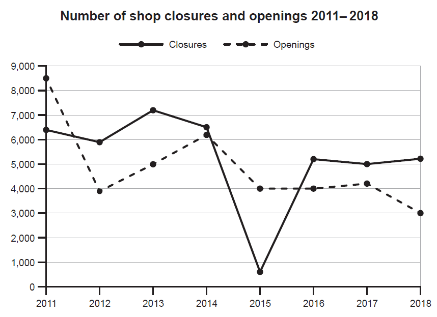

The graph below shows the **number of shops** that **closed** and the number of new shops that opened in one country between 2011 and 2018.

Summarise the information by selecting and reporting the main features, and make comparisons where relevant.




Main features

comparisons


This diagram detailed above illustrates two trend that both the closed and new opened number of shops in one coutry from 2011 to 2018.

// overall

Overall, during those 8 years, the number of closurses is more higher than the number of openings. Both closure number and opening number are in a large range of variations.

// detail1: closures are higher 

The closures are steady at just over 6000 between 2011 and 2014, then it met a big drop in 2015 at less than 1000. Finaly, the closures steady again at around 5000 after that. While the openings saw a big drop in 2012 from over 8000 to 4000, then rised to over 6000 in 2014. After 2014, the openings are steady around 4000 and saw a little drop in 2018 at 3000.

// detail2: 

The closures are surpass the openings except 2011 and 2015. In the years where the closures over the openings, the closures is 2000 over the openings in 2012, 2013 an 2018 and 1000 over in 2016 and 2017. In the years where the closures less than the openings, the openings is around 3000 over the closures.


**at just over 6000**

higher

rise -> 过去式raised

注意时态

```text
This diagram detailed above illustrates two trends that both the closed and new opened number of shops in one country from 2011 to 2018.

Overall, during those 8 years, the number of closures is higher than the number of openings. Both closure number and opening number are in a large range of variations.

The closures were steady at just over 6000 between 2011 and 2014, then it met a big drop in 2015 at less than 1000.  Finally, the closures steady again at around 5000 after that. While the openings saw a big drop in 2012 from over 8000 to 4000, then raised to over 6000 in 2014. After 2014, the openings are steady around 4000 and saw a little drop in 2018 at 3000.

The closures surpass the openings except 2011 and 2015. In the years where the closures over the openings, the closures are 2000 over the openings in 2012, 2013 and 2018 and 1000 over in 2016 and 2017. In the years where the closures were less than the openings, the openings were around 3000 over the closures.

```

