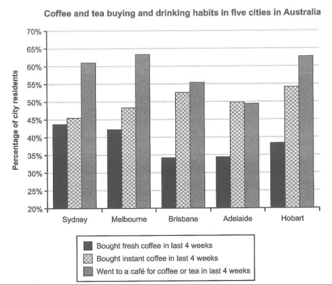

The chart below shows the results of a survey about people's coffee and tea buying and drinking habits in five Australian cities.


Summarise the information by selecting and reporting the main features，and make comparisons where relevant.





Survey: -> coffee vs tea buying & drinking habits 

In five Australian cities

Searching result about 


Sumarise: main features

Comparisons

// introduction

The diagram detailed above illustrates the survey result of how many percents of people bought and drunk coffee and tea across five cities in Austrilia in last four weeks.

// overall

As the illustration shows, people were more likelly to buy instant coffe or go to a cafe for dinking than buying fresh coffee and going to a cafe was the most common way except Adelaide. What's more, some cities' citizens love drinking coffee or tea more than the others.

// detail1: most people like goting to a cafe

In all five cities, buying fresh coffee is the least habit from less than 35 percents to 45 percents, but nearly all cities' people who went to a cafe are over 55 percents except Adelaida which is 48 percents. The percentage of people who bought instant coffee is usually the middle of three from 45 percents to 54 percents and the number is slightly surpass the percentage of who go to a cafe in Adelaide.

// detail2: 

The percentages of people who love drinking coffee or tea in different ways are various. People in Melboume love going to a cafe the most which is 64 percents, while people in Adelaide are the least. People in Hobart love buying instant coffee the most which is 54 percents and people in Adelaide and Brisband were the least to buy fresh coffee.


**错误**

percent 不可数

drink -> drank 过去式

likely

more than others 没有the

The number of a  surpasses b

Those who go to a cafe

the most, which is 


surpass 超过

## 优化


```text
The diagram detailed above illustrates the survey result of how many percent of people bought and drank coffee and tea across five cities in Australia in the last four weeks.

As the illustration shows, people were more likely to buy instant coffee or go to a cafe for drinking than buying fresh coffee and going to a cafe was the most common way except Adelaide.  What is more, some cities' citizens love drinking coffee or tea more than others.

In all five cities, buying fresh coffee is the minimal habit from less than 35 percent to 45 percent, but almost all cities' people who went to a cafe are over 55 percent except Adelaida, which is 48 percent. The percentage of people who bought instant coffee was in the middle of three from 45 percent to 54 percent and the number slightly surpasses the percentage of those who go to a cafe in Adelaide.

The percentages of people who love drinking coffee or tea in different ways are various. People in Melboume love going to a cafe the most, which is 64 percent, while people in Adelaide are the least. People in Hobart love buying instant coffee the most, which is 54 percent and people in Adelaide and Brisbane were the least to buy fresh coffee.
```


## 范文

```text
The chart illustrates people's behaviour in terms of consuming and purchasing coffee and tea for 4 weeks in five Australian cities (Sydney, Melbourne, Brisbane, Adelaide, and Hobart). 

Overall, the residents who went to cafes for coffee and tea have shown the highest percentage among the other categories, followed by the amount of purchases of instant coffee. However, people in Australia had the least interest to buy fresh caffeine which was shown as the lowest percentage based on the survey. 

As can be seen on the graph, Melbourne and Hobart have shown the most significant interest in instant coffee which has shown in nearly 64% of the population although it had less amount of people who bought fresh coffee within 4 weeks. Despite that, approximately 44% of people in Sydney tend to consume fresh coffee, hence it was the highest number for the purchase of fresh coffee among the other countries. 

Over 50% of society in Australia seems to have lots of interest in fresh coffee followed by the average amount that has purchased instant coffee. While the behaviour of going to the cafe throughout these 4 weeks tends to differ between these countries.
```


