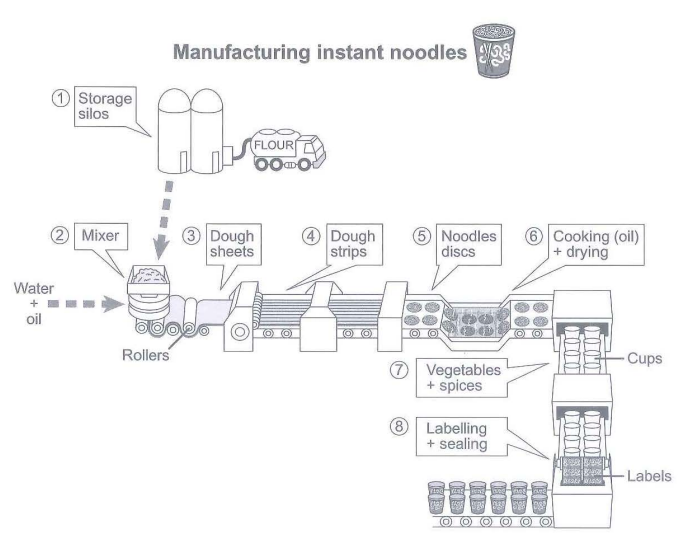

The diagram below shows how instant noodles are manufactured. 

Summarise the information by selecting and reporting the main features，and make comparisons where relevant.




 procedures for making instant noddles


1. Storage silos maintain huge amount of flour.
2. Mix: mixer + water + oil + flour
3. through rollers: Dough sheets: -> dough strips -> noodles discs
4. 6: cooking(drown into the oil) + drying : drown into the oil
5. Package: vegetables + spices, labelling + sealing


// introduction

The diagram shown above illustrates eight main parts of the procedure of making instant noddles in manufactory.

The making process is comprised of five main stages including preparing materials, making Dough, making dices use special equipment, followed by cooking and drying, finally packaging with other foods.

// detail1: prepare meterials, 

In the first step, the factory uses several storage silos to maintain huge amount of flour and sends flour into the mixer. The mixer mixes flour with water and oil to create dough. Next, the produce line consist of rollers and other equipment to handle dough, making dough into dough sheets, dough strips and finally noddles discs.

After getting the discs, the produce line cook them using oil, then drying the cooked discs. The packaging stage consist of two steps, the first is pacaging discs into cups for the convenient of customers and adding some vegetables and spices for nutrition. Finally, the instant noodle cups need to be labelled and sealled, then it can be stored for long time.


**错误:** 

show -> 过去式showed -> 过去分词 shown

动名词

a huge amount of 

The line consists of 单数

other ->> additional 

Convenient形容词 -> convenience名词

for a long time

```text
The diagram shown above illustrates eight main parts of the procedure of making instant noddles in manufactory.

The making process is comprised of five main stages including preparing materials, making dough, making dices using special equipment, followed by cooking and drying, finally packaging with other foods.

In the first step, the factory uses several storage silos to maintain a huge amount of flour and sends flour into the mixer. The mixer mixes flour with water and oil to create dough. Next, the produce line consists of rollers and other equipment to handle dough, making dough into dough sheets, dough strips and finally noodles discs.

After getting the discs, the produce line cooks them using oil, then drying the cooked discs. The packaging stage consists of two steps and the first is packing discs into cups for the convenience of customers and adding some vegetables and spices for nutrition. Finally, the instant noodle cups need to be labeled and sealed, then they can be stored for a long time.
```


## 范文

```text
The process diagram illustrates step by step approaches how instant nodules are produced.

Overall, there are eight steps beginning with the storage in silos of flour delivered by lorries and ending with packaging of instant noodles. This packaged food is made of mainly five ingredients, namely, flour, water, oil, vegetables and spices.

Looking at the first five stages of the manufacturing process, flour, after having been delivered to storage silos by lorries, is transported to a mixer where it is stirred with water and oil.  This mixture is then transformed into dough sheets by rollers, followed by cutting in dough strips, which are eventually converted into circular discs.

Taking into consideration of the following steps, firstly, the noodles discs are cooked in oil, and after this, they are dried. Then, the dried stacks of noodles are put in assembled cups where vegetables and spices are added. These cups are labelled and sealed afterwards, ending the manufacturing process. This is how instant noodles are produced in eight steps, starting with flour delivery by trucks, and finishing with the noodles being packed in labelled and sealed cups.
```


```text
The given picture illustrates the process by which instant noodles are produced.

Overall, it is clear that there are 8 stages in this linear process, commencing with storing flour in silos and ending with labeling and sealing cups.

At the first stage of this process, flour is pumped from a truck into tower silos for storage before being put into a mixing machine, where it is mixed with a combination of water and oil. *After this stage has been completed*, the resulting mixture is rolled over to create dough sheets, and then going through a machine to be separated into strips.

During the next stage, these dough strips are molded into noodles discs, after which they are cooked with oil and left to dry. Following this, these dried noodles discs, together with vegetables and spices, are put into cups, and the process finally ends with these cups being labeled and sealed.

```


