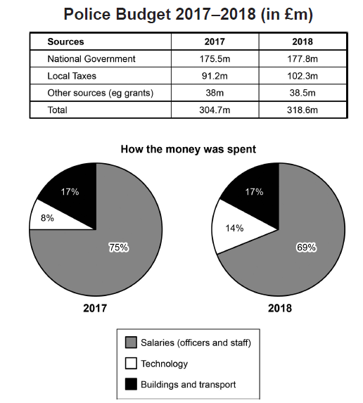

The table and charts below give information on the police budget for 2017 and 2018 in one area of Britain. The table shows where the money came from and the charts show how it was distributed.

Summarise the information by selecting and reporting the main features, and make comparisons where relevant.




**Information: police budget (2017, 2018) ** in one area of Britain.

**Came from** ->> **distributed**


Summarise information 

- Summarise Main features
- Comparision relevant things


// introduction

Those diagrams shown above illustrate detail of the 2017 and 2018 budget in one area of Britain and it consists of both the sources and the targets.

// overall

// 时间维度, 出入维度

Overall, the 2018 budget is 13.9m more than the 2017 budget and most of that part comes from the increase of local taxes. In 2018 the budget will share 5 percents more on technology than in 2017 and  the salaries will hold 5 percents less.

// detail1 收支的feature.

The police budget is comming from three main sources and the national government take the largest part, which is 175.5m in 2017 and 177.8 in 2018. The local taxes is the second resource and it take a large increase in 2018, which is 11.1m more than in 2017. The budget are also spending on three major parts, the salaries of officers and staff, technology, building and transport. The salary occupy more than 60 percents of the whole budget and the building and transport holding the second, then the technology is the least.

// 2. compare : 

The total source of the budget increase 13.9m in 2018, which is 318.6m. The increase part comes from local taxes 11.1m, national government 2.3m and other resources 0.5m. In 2018, the buildings and trasport budget will stay the same, but the salariyes will take five percents less and the technology will take five percents more.


occupy -> proportion

surpass


**错误:** 

the increase in xxx

in  2018, 是一个小短句.

percent 不可数

**注意用一般现在时**: it comes from, 名词主语后面不要用动词.

it takes 用单数

Spent 被动

**occupies**  占了

the increase 可以做名词.


## 修改后

```text
Those diagrams shown above illustrate detail of the 2017 and 2018 budget in one area of Britain and it consists of both the sources and the targets.

Overall, the 2018 budget is 13.9m more than the 2017 budget and most of that part comes from the increase in local taxes. In 2018, the budget will share five percent higher on technology than in 2017 and the salaries will hold five percent less.

The police budget comes from three main sources and the national government takes the largest part, which is 175.5m in 2017 and 177.8 in 2018.  Local taxes are the second resource and it takes a large increase in 2018, which is 11.1m more than in 2017. The budget is spent on three major parts, the salaries of officers and staff, technology, building and transport. The salary occupies more than 60 percent of the whole budget and the building and transport part holds the second, then the technology is the least.

The total source of the budget increased 13.9m in 2018, which is 318.6m. The increase comes from local taxes 11.1m, national government 2.3m and other resources 0.5m. In 2018, the buildings and transport budget will stay the same, but the salaries will take five percent less and the technology will take five percent more.

```


## 范文

```text
The table and charts depict information about the police budget in one locality of Britain in 2017 and 2018. The table represents from which sources money came, and the charts illustrate for what purposes this amount was used.

Overall, the budget increased significantly in 2018 than in 2017, and local taxes contributed more to this raise. The money spent on Building and transport remained the same during both years.

In 2017, the national government contributed 175.5m to the police budget, whereas in 2018, it was 177.8m. Local taxes in 2018 raised nearly 10m (102.3m) compared to 2017(91.2m). The input from other sources, such as grants, remained almost equal for both years, around 38m.

The money used to give officers and staff salaries was three-quarters of the total budget(75%) in 2017, which was then reduced to 69% in 2018. The amount spent on Building and transport remained the same in 2017 and 2018. (17%). The amount used for technology reached less than double in 2018 (14%), which was 8% in 2017.
```


