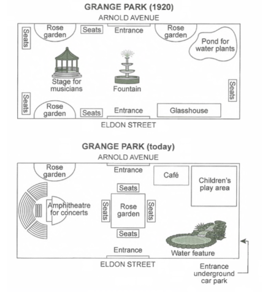

The plans below show a public park when it first opened in 1920 and the same park today.

*Summarise the information by selecting and reporting the main features, and make comparisons where relevant.*

**public part** -> first open 1920 -> today

Summarise 

- main features
- compar relevants


// introduction:

The two maps shown above illustrate the layout of a public park both in current and the time when it opened in 1920.

// overall

Main features

Compare: 

- Seats 
- Rouse garden cut down from 3 -> 1
- Entrance 
- more facilities: children play are, cafe, water features amphitheatre
- Shot -> sttage, funtain, glasshouse, pond for water plants

Overall, the current layout of the park is significant different from the initial layout. There are plenty facilities more and others disappear.

// detail1:

layout

As we can see in 1920, there are two entrances in both north and sourth side of the park and a funtain in the middle. The stage for musicians located in the left side of the fountain and a glasshouse and a pond for water plants seperate located in the eastsource and eastnorth corners. What else, there are several seats ares and rose gardens distribute along the around of the central park. 

But things are quit different today, both the location and the facilities. Although two entrances are save, an undergraound car park entrance is add in the right side of the park. One square rose garden is located in the central of the park and one rose garden is removed. The stage is replaced by a amphitheatre for concerts in the left part of the park and the glasshouse is substituded by a water feature. Besides, a new children's play area replace the pond in the eastnorth of the park and the park introduce an cafe besides the play area and rearrange the location of all seats


**错误:**

Significantly xxx

**Layout** -> distribution

on the north and south side of 

it is **located** **on** 

Separately located

East-south / east-north

what's else

**outskirts** of

quite

is added to the xxx

substitute 

**replaces** 单数

```text
The two maps shown above illustrate the layout of a public park both in current and the time when it opened in 1920.

Overall, the current layout of the park is significantly different from the initial layout. There are more facilities and others disappear.

As we can see in 1920, there are two entrances on both the north and south side of the park and a fountain in the middle. The stage for musicians is located on the left side of the fountain and a glasshouse and a pond for water plants are separately located in the east-south and east-north corners.  Also, there are several seat areas and rose gardens distributed along the outskirts of the central park. 

But things are quite different today, both the location and the facilities. Although two entrances are saved, an underground car park entrance is added to the right side of the park. One square rose garden is located in the center of the park and one rose garden is removed. The stage is replaced by an amphitheatre for concerts in the left part of the park and the glasshouse is substituted by a water feature. Besides, a new children's play area replaces the pond in the east-north of the park and the park introduces a cafe besides the play area and rearrange the location of all seats.

```

## 范文

```text
The maps outline the changes that took place in a public park called Grange Park from 1920 to today. 

Overall, the park was changed and renovated to offer people more possibilities than they used to have decades ago such as a cafe, theatre, playground and parking.

In details, the park was opened in 1920 and entertainment facilities including a larger stage and various areas for recreation have since been added to it. There was also notable relocation in terms of seats and the only areas that remained unchanged were the entrances and one minor garden. Besides, the fountain has been removed in favour of a rose garden with full seating arrangements around it. To the left of the new garden, the previous stage for musicians has been turned into a much larger amphitheatre facing the opposite direction that will allow for concerts in the park. This change has necessitated the removal of both seatings on the far left side as well as the rose garden in the bottom left corner of the map.

Moreover, the pond for water plants was removed from the right -top part of the garden and a children's play area was introduced in the right-top of the park, and near this area, a cafe was built. Instead of the pond, a water feature has been built occupying the bottom right corner. Interestingly, the number of rose gardens was reduced to two. Besides, an underground car park was built in the lower right corner of the park.


```

```text
The maps illustrate the overall development of Grange park in Arnold avenue staged in two different periods - the first one depicts the park during its inauguration in 1920, and the latter portrays its present-day layout. 

Generally speaking, the overall layout of the park has been changed drastically except for the main entrances at Arnold avenue and Eldon Street. 

The park first opened in 1920, and it went through drastic developments since then. To begin with, the key feature of the park- the central fountain, has been demolished. The rose garden was earlier scattered around the periphery of the park along with the seating arrangements, but now it has been remobilised to the centre of the park. Meanwhile, the stage for the musicians has been further converted to an "Amphitheatre" for concerts to accommodate a larger crowd. However, the rose garden on the northwest has been retained. 

Besides, the glasshouse on the southeast side has been redesigned with a water feature and an underground entrance to the car park for visitors. The addition of amenities such as the cafe on the northeast side adjacent to Arnold avenue was also done. Finally, the pond of water plants was redesigned to accommodate a children’s play area.

```

