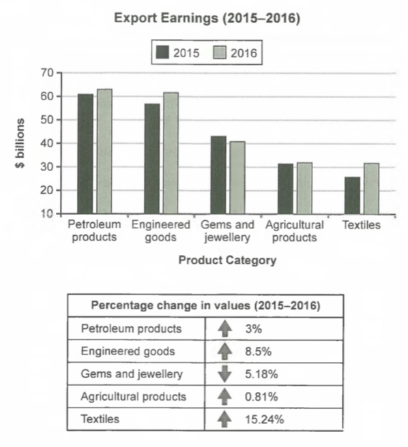

0223-C14T2-混合图

The chart below shows the value of one country's exports in various categories during 2015 and 2016. The table shows the percentage change in each category of exports in 2016 compared with 2015.

Summarise the information by selecting and reporting the main features, and make comparisons where relevant.*

Chart:

Value of one country's exports

- Various categories, 2015 vs 2016.

Table:

- percentage change in each category 

// introduction

 The chart and percentage table provide the imformation about five categories' export values of one country in 2015 and 2016. The chart displays export values, while the table shows the exact percantage changes.

// overall

Overall, both the 2015 and 2016 export earnings consist of five categories and petroieum products took the largest part. What's more, the gross export value in 2016 was higher than 2015 and four of five categories were surpass 2015. 

// detail1: features

// the export values is slightly different from 2015 to 2016, the five categories took 

In 2015, the most popular export product was pertrleum products, which earned 60 billions. The second was engineered goods, which provided 56 billions, then the gems and juwellery were 41 billions, agricultural products was 31 billions and finnaly textiles were 25 billions. In 2016, pertroleum products was also the largest, which provided 62 billions, engineered goods the second, 61 billions, gems and jewllery the third, 41 billions. Agricultrual products took the same as textiles, which is 31 billions.

// detail2: compare

The gross earnings in 2016 was surpass those in 2015. The textiles shown the sharpest increase, which is 15.24 percent and around 7 bilions. Although eanieered goods already took a large part of export earnings, it ranked the second place, 8.5 percent. Then the pentroleum products increased 3 percent and agricultural products increased 0.81 percent. Finally, the gems and jewellery were the only category cut lower in 2016, which is 5.18 percent.


**错误:**

Provide information about, 不用the

60 billion 不要加s

a and b, Which were

A surpass B, 不需要 is

Shown, showed

Rank second.

慎用the

```text
 The chart and percentage table provide information about five categories' export values of one country in 2015 and 2016. The chart displays export values, while the table shows the exact percentage changes.

Overall, both the 2015 and 2016 export earnings consist of five categories and petroleum products took the largest part. What's more, the gross export value in 2016 was higher than 2015 and four of five categories surpass 2015. 

In 2015, the most popular export product was petroleum products, which earned 60 billion. The second was engineered goods, which provided 56 billion, then the gems and jewellery were 41 billion, agricultural products were 31 billion and finally textiles were 25 billion. In 2016, petroleum products were also the largest, which provided 62 billion, engineered goods the second, 61 billion, gems and jewellery the third, 41 billion. Agricultrual products took the same as textiles, which were 31 billion.

The gross earnings in 2016 surpassed those in 2015. The textiles showed the sharpest increase, which is 15.24 percent and around 7 billion. Although eanieered goods already took a large part of export earnings, it ranked second place, 8.5 percent. Then the petroleum products increased three percent and agricultural products increased 0.81 percent. Finally, gems and jewelry were the only category cut lower in 2016, which is 5.18 percent.
```

## 范文

The bar graph compares export earnings of a country in billions of dollars from five different product categories in 2015 and 2016 while the table data outlines the percentage change in export revenue in 2016 than that of the previous year.

Overall, petroleum and engineered products were the main export revenue earners for this country both in 2015 and 2016, and the export amount increased in 2016 than the figure of previous years except for gems and jewellery commodities.

In details, the country earned approximately 220 billion dollars from its export trades in 2015 which increased by around 10 billion dollars next year. In 2015, earning from petroleum export was over 60 billion dollars, the highest amount, while engineered goods brought nearly 58 billion, the second-highest. Next year they made roughly 63 and 62 billion respectively. Jewellery and agricultural products consisted of 70 billion income in 2015 while the textile goods secured around 27 billion, which was the lowest. In 2016, the country exported just over 30 billion dollar's textile and agro merchandises each, and nearly 40 billion dollar's jewellery.  

Next year, the country gained more export revenue except for jewellery products, revenue from which dropped by nearly 5%. Besides, the export of engineered goods soared by 8.5% while the highest increase was for textile products, over 15%. Finally, it earned 3% and approximately 1% more from petroleum and agricultural merchandises in 2016 than that of 2015.

