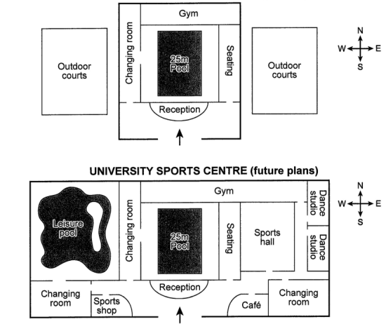

0227-C13T4-地图

The plans below show the layout of a university’s sports centre now, and how it will look after redevelopment.

Summarise the information by selecting and reporting the main features, and make comparisons where relevant.




the layout of university's sports center 

now VS futer fater redevelopment

Summarise

// introduction

The two diagrams shown above illustrate the layout of a soprts centre located in a university both currently and in the future because a redevelopment will applied.

// overall

// expand a lot, outdoor courts are 

// current layout in the original centre is same. bring lots

Overall, although the main layout of the original centre's center would not change after redevelopment, it expand a lot because more facilities and rooms will be constracted.

// detail1: summarise main features

Currently, two outdoor courts at both the left and right side of the sports centra and the reception infronts of the entrance at the source side. After geting into the centre, a 25m pool is in the center and a changing room on the left, a seating area on the right, while a gym on the behind. 

// detail2: comparision

In comparison, the sports center will be removed the two outdoor courts and introduce more facilities. The west outdoor courts will be replaced by a leisure pool and a new changing room and a sports shop will be located on the south. On the other side ot the sports center, the outdoor courts will be replaced by a sports hall. In addition, the gym will be strengthen to the east and two dance studios will be bringed on the east side. Finally, a cafe and a changing room will be created on the south-east part of the centre.


**错误:**

a redevelopment will **be** applied 

constructed

**On** both sides 用on和复数. 

**in the north/south**

getting 双t

Be strenghened 

Bring -> brought

It expanded a lot, 这个expanded要用过去式.

```text
The two diagrams shown above illustrate the layout of a sports centre located in a university both currently and in the future because a redevelopment will be applied.

Overall, although the main layout of the original centre's center would not change after redevelopment, it expanded a lot because more facilities and rooms will be constructed.

Currently, two outdoor courts on both the left and right sides of the sports centra and the reception infronts of the entrance at the source side. After getting into the centre, a 25m pool is in the center and a changing room on the left, a seating area on the right, while a gym on the behind. 

In comparison, the sports center will remove the two outdoor courts and introduce additional facilities. The west outdoor courts will be replaced by a leisure pool and a new changing room and a sports shop will be located in the south. On the other side of the sports center, the outdoor courts will be replaced by a sports hall. In addition, the gym will be strengthened to the east and two dance studios will be brought on the east side. Finally, a cafe and a changing room will be created in the south-east part of the centre.
```

## 范文


```
The layout of a University’s sports centre at present and its proposed changes are picturised in the given plans.

At present, the university sports centre is a rectangular building which has outdoor courts both at its East and West. In the main building, towards the left of the reception, there is a changing room, and just opposite to it, across the 25m pool, there exists the seating facility. It also has a gym towards its North.

The first noticeable change which is seen in the future plan is the addition of a leisure pool at the West, next to the changing room. Towards the south of the leisure pool, where an outdoor court is situated now, there would be an additional changing room and a sports shop. Opposite to these two, towards the East, another changing room is planned with an adjacent cafe. The outdoor court at the East would be transformed to a sports hall and towards its further East two dance studios are planned. The next visible change, is the expansion of gym towards the East.

Overall, the projected added facilities to the University’s sports centre would make it look well-develpoed.
```


