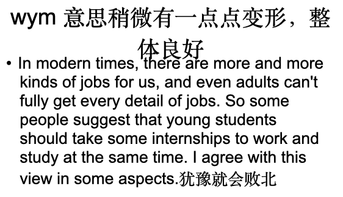
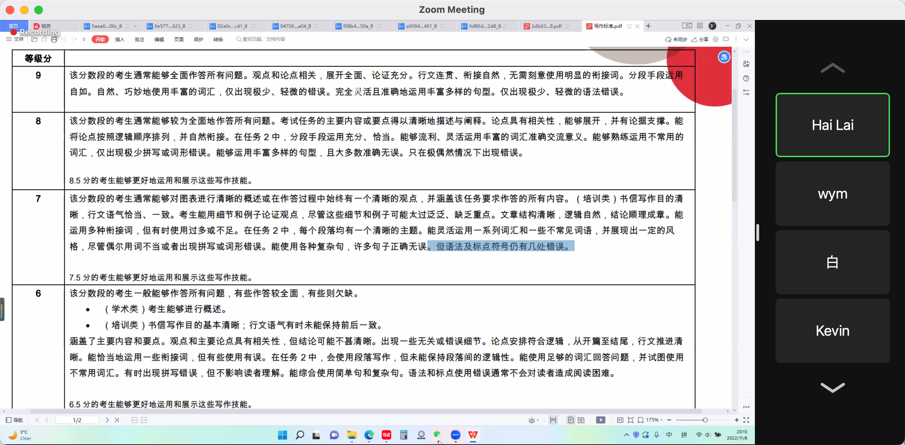

## Task1:

https://www.youtube.com/watch?v=YB3cZNWLINo&t=19s

1. **文章四段:** 

1. introduction:

   Paraphrase the question: 解释问题, 解释一下图表是关于什么的.

   开头要强一点.

2. Overview

   2 sentences, 2 main points: 

   突出两个overview的点, 每个点2句话就行.

3. Detail

   compare 一组, changes over  time.

   开头直接回答问题, 扩展关键点内的信息, 2个reasons, 举例子

4. Detail

   compare 另一组, changes over  time/xxx

句子写长了, 需要检查一下语法.

## Task2:

**重点:**

1. **Task response**
2. **Coherence and cohesion: 连贯和完整.**
3. **Vocabulary.**
3. 观点不要犹豫!

**文章part:** 分成四部分

- 10 minutes of planning time.

1. **Introduction: ** 
   
   1. **2 sentences only.**
   2. 5 minutes
   
   - 同义转述, 文章会描述. 从题目中找.
   
2. **2个main paragraph:**
   
   1. **每个5句话**
   
   2. 10 minutes each paragraph
   
      **对于有很多idea的:**
   
      1. advantages
      2. disadvantages
      3. problems
      4. solutions
   
      **对于只有一个idea的:**
   
      1. Idea
      2. Explain
      3. Example
      
      **废话理论:** 很傻的因果也可以说一下.
      
      不要用举例皆为, 要用 as a result/ so 总结观点结尾.
      
      - 相同的两段, 一定要加一个besides
      - **because。。。 for example...  as a result...  so/therefore,**
   
3. **Conclusion paragraph:**
   1. **1个sentence.**
   2. 5 minutes

**目标标准:**

1. Linking words, meeting the goal of 7 or more

2. **4**Repeated words, meeting the goal of 3 or fewer

3. **0**Mistakes

赖老师的:

第一段:

1. 同义转换(paraphrase)+文章会描述.

   换词, 词性, 主动和被动, 从句

   - 要从题目中找, 不要自己瞎想. 人家问职业发展和个人成长. 

   - 不要写**自相矛盾**的话. 选择一边, 不要左右都提.

   - 段和段之间没有however

   - **conclusion 明显一些:**

     我的本篇文章说了什么? 

     因为xxxx, over.

- 观点之间的连续性, convencing
- 观点可以不直接写为什么, 用2个例子解释.然后总结.

elaborate: 解释

elaboration: 

### writing9 建议的:

For we to consider an essay structure a great one, it should be looking like this:

- Paragraph 1 - Introduction

- - Sentence 1 - Background statement
  - Sentence 2 - Detailed background statement
  - Sentence 3 - Thesis
  - Sentence 4 - Outline sentence

- Paragraph 2 - First supporting paragraph

- - Sentence 1 - Topic sentence
  - Sentence 2 - Example
  - Sentence 3 - Discussion
  - Sentence 4 - Conclusion

- Paragraph 3 - Second supporting paragraph

- - Sentence 1 - Topic sentence
  - Sentence 2 - Example
  - Sentence 3 - Discussion
  - Sentence 4 - Conclusion

- Paragraph 4 - Conclusion

- - Sentence 1 - Summary
  - Sentence 2 - Restatement of thesis
  - Sentence 3 - Prediction or recommendation

