P1- 3句完整话

P2 - 2分钟, 多说一点, 扯点没用的.

p3 - 学会对比.

### 1029

I would meet my friends

 It depends on who you are meeting with 

take into account their opinion 

listen to 

had taken 

I was fortunate/lucky 

daily spendings to save up 

but for the phone itself 

keys

 well

-----

cautious
seat
Ike'y
arrangement
effect
revolution
Personality charm
male virgin

Seniors 学长

## 0213-

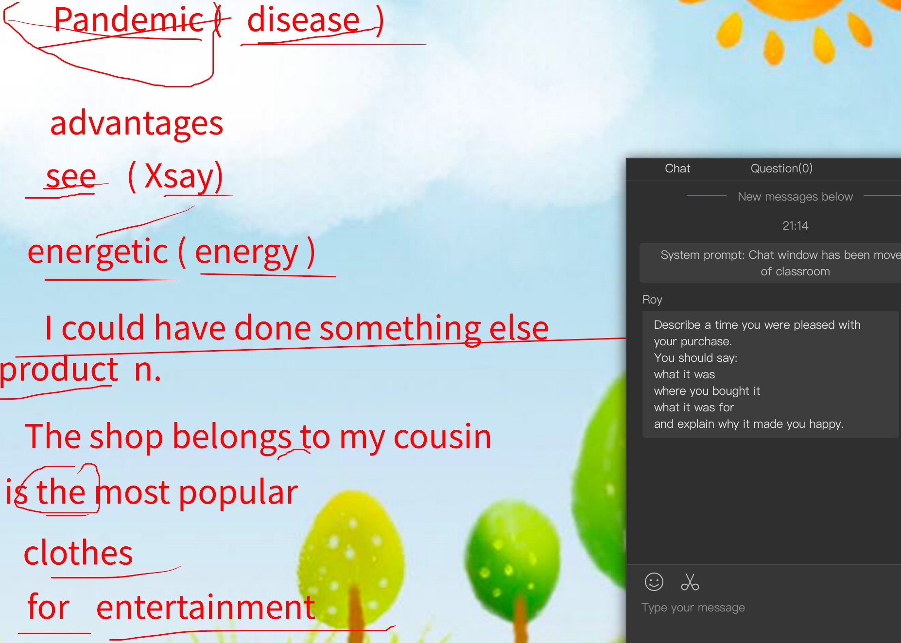

## 0215-

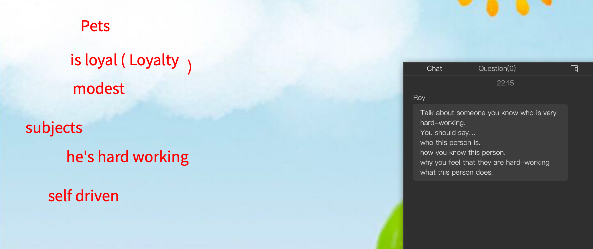

## 0216- 

## 02-18

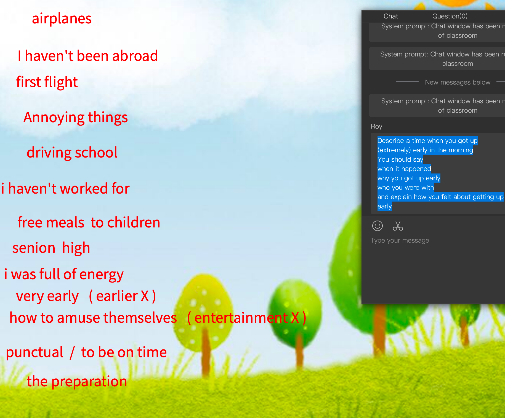

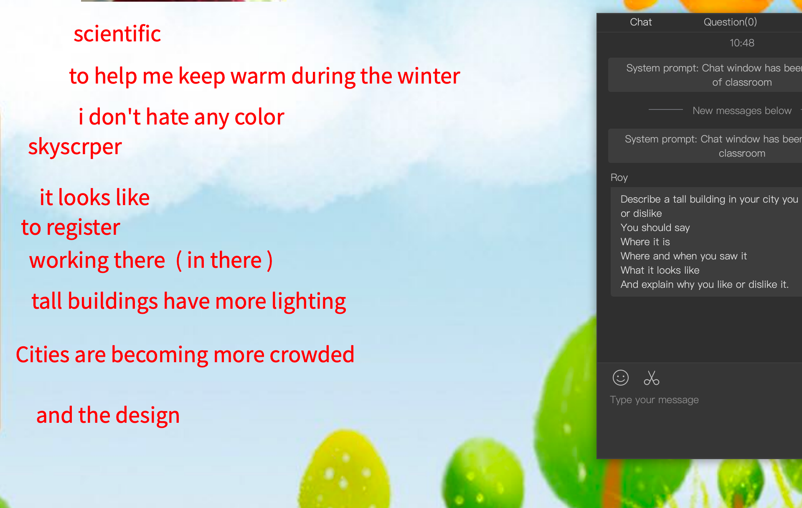

## 0221

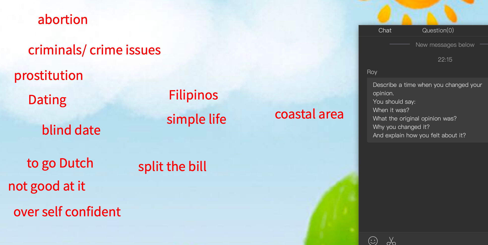

## 0223

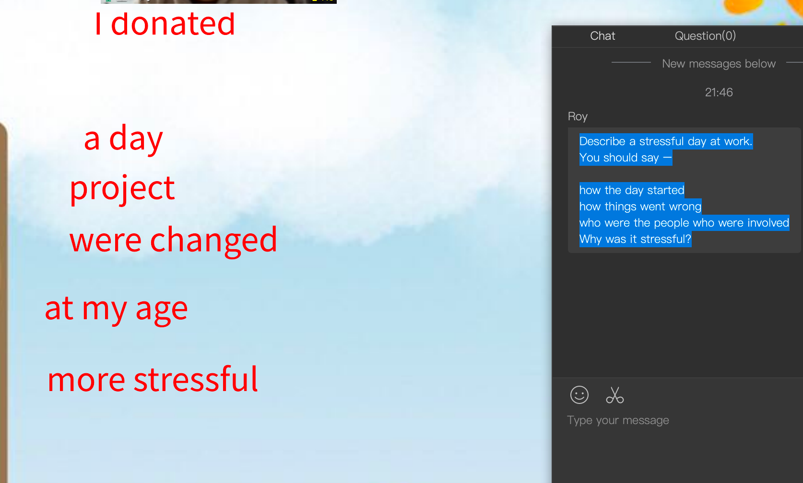

## 0224

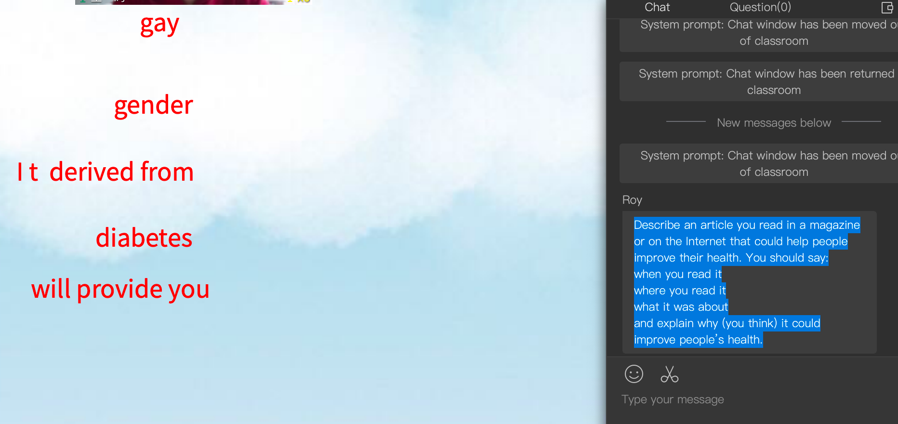

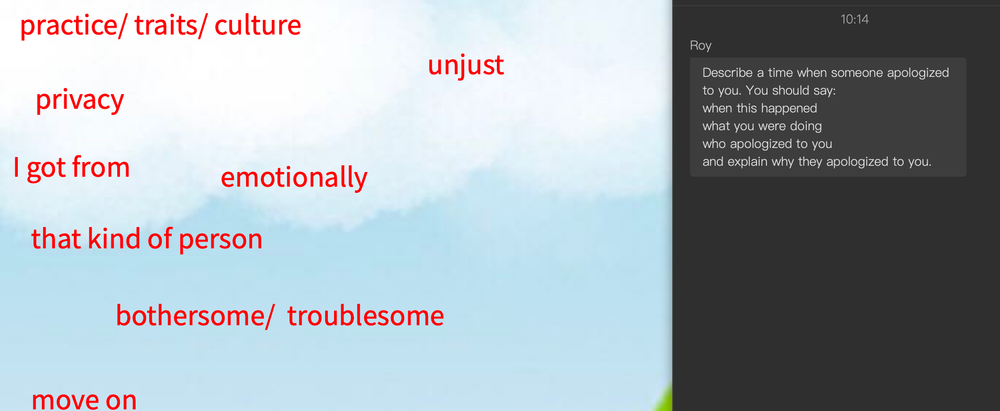

## 0228

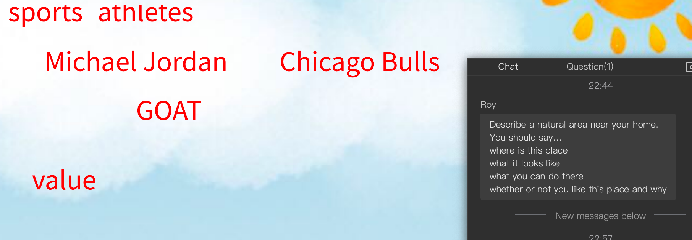

## 0302

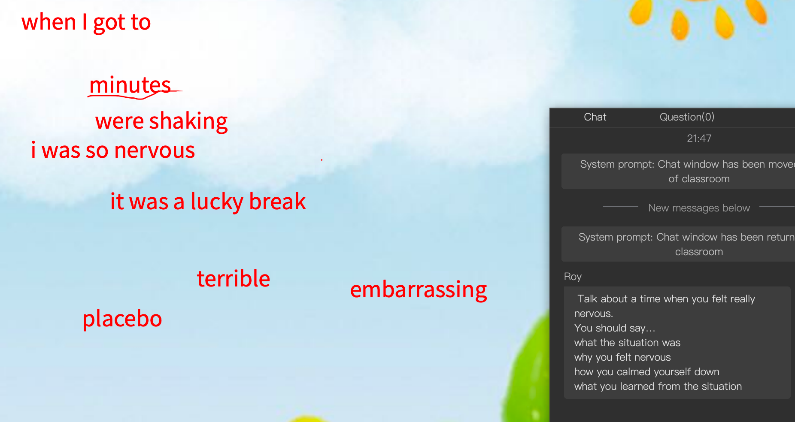

## 0303 

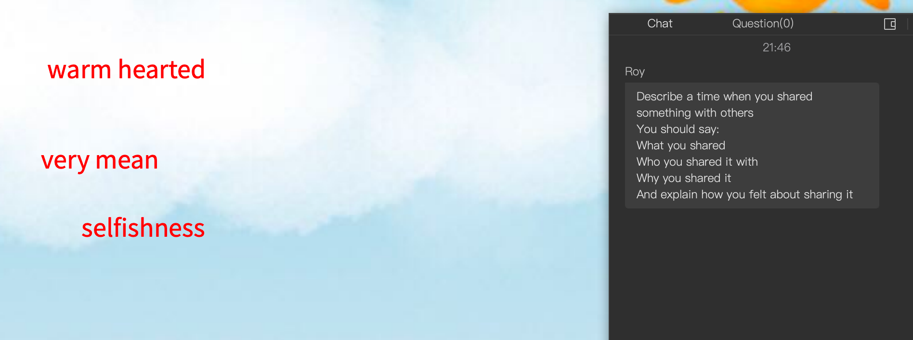

