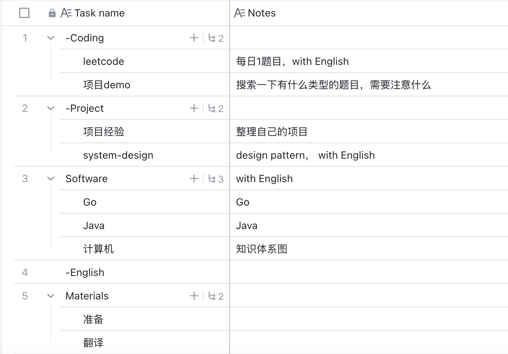

**Current：**

- important materials
- appointment visa interview（January、February）
- Job_skills:
  - English
  - Working Skill
  - Software Knowledge
  - Coding
- Job_searching for materials: one or two.
  

[23年时间表](https://www.feishu.cn/docx/L4O4dMRkyo3dRExjblUcmS9fnuf)

## Objects

- material
- Visa - order interview time
- work relations
  - skills
  - search

## Time arrange

- ~01.01
  - important materials
  - appointment visa interview（January、February）
  - Job_skills:
    - English
    - Working Skill
    - Software Knowledge
    - Coding
  - Job_searching for materials: one or two.

- ~04.01
  - Job_skills
  - Job_searching

- ~06.01
  - get offer
  - Ask for leave

- ~07.01

  - Plan for Germany

- 07.01 - 08.01

  go，home，easy

## Time line

23[week33 - 54]

### 0917： week36

下周TODO：

- 搜索经验、问问题，调整计划, 预约

- 材料list-Materials

  - 申请表-翻译资料

- ——点

  - English：-
  - Coding： leetcode， 项目demo
    - TestDriven
  - Project： 
    - system-design，有什么项目
    - 项目经验总结
  - software：
    - Go - 
    - 知识体系， java
    - 技术文章-知识体系图

  

**这周总结：**

这周工作很忙。周日看了一些go。

英语：在练，下周应该每天看一点TedED

材料：没准备

### 0910：week35

- 搜索经验、问问题，调整计划, 预约
- 材料list
  - 申请表-翻译资料
- ——点
  - Software-技术文章-知识体系图
  - Coding： leetcode， 项目demo
  - Project： system-design，有什么项目
  - software：
    - Go
    - 知识体系， java
  - English：
  - materials：

### 0903: week34

**下周目标：**

- 搜索经验、问问题，调整计划, 预约
- 材料list
  - 申请表-翻译资料
- ——
  - Software-技术文章-知识体系图

**本周visa目标：**

- 材料list：
  - 翻译材料
  - 申请表
- Work
  - 项目整理，CV
  - English
  - 技术
  - 编程
    - leetcode- English explain
- 时间表：甘特图 - done
- 搜索经验、问问题，调整计划
- 预约
- Interview
- 计划定制 - done
  - 

1. 列一个材料list

2. 1. 翻译一点：

   2. 申请表：

   3. work：

   4. 1. 项目整理，cv
      2. English review
      3. 每天看一篇技术文章？

   5. 甘特图：

3. 问问题，然后修改一下计划

4. 脚本照常跑，监控着

5. leetcode， English explain mind

### 0829：week34

当下，几乎什么也没推动。我想慢慢转身，向前。没有向前，不知道转没有转身。

### 0808：week31

我觉得，当下最重要的是

- 把自己的动机信，优化一下
- 全面工作part
  - 技能（准备）work_background
  - 找工作（动作）work_searching

​    
