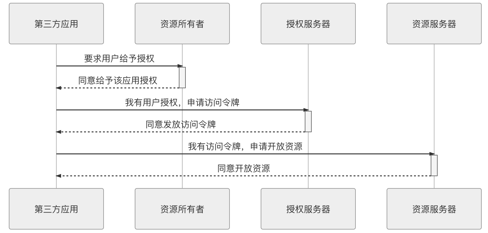
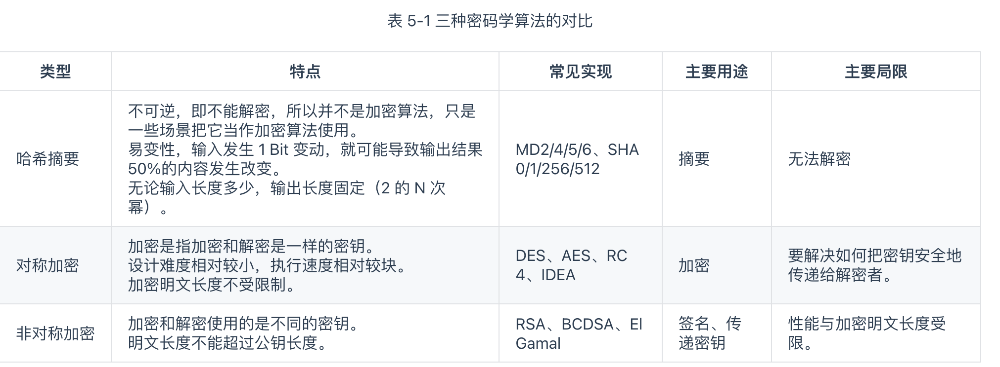

## 演进中的架构

> 这一章讲了架构的演进:
>
> 半成品的分布式, 仿照unix的, 但是不符合当时的物理条件, 计算性能等没有办法实现
>
> 单体系统: 变成大单体, 大单体的概念应该是系统进程通讯啊什么的
>
> SOA时代: 第一个十年流行
>
> 微服务: 不同于SOA, 两种理念, 更偏向于理念
>
> 后微服务时代: 用mesh啊什么的
>
> 无服务时代: 感觉是serviceless, 函数化那种.

# 架构师的视角

## 一. 访问远程服务

### 远程服务调用 RPC

remote procedure call, 面向方法/过程来编程

是为了让计算机调用远程方法, 像本地方法一样. 

**进程间通讯:** inter-process communication

- 管道, 信号, 信号量
- 消息队列, 共享内存, socket(当仅限于本机进程间通信时，套接字接口是被优化过的，不会经过网络协议栈)

- Socket 是网络栈的统一接口, 支持跨机器的进程间通信. 原始的分布式时代就是类似的统一接口, 把远程调用与本地的进程间通信统一编码

  程序员会误以为**通信是无成本的**

**RPC** 应该是一种高层次的或者说语言层次的特征，而不是像 IPC 那样，是低层次的或者说系统层次的特征成为工业界、学术界的主流观点。

需要处理`8 Fallacies of Distributed Computing` 8个问题

**RPC的三个基本问题:**

- 序列化和反序列化: 如何表示数据

- 如何传输协议: 应用层协议, 一般都是在TCP、UDP 的传输层协议上加的

  应用层协议需要考虑 许多参数之外的信息，譬如异常、超时、安全、认证、授权、事务，等等，都可能产生双方需要交换信息的需求

- 如何确定方法: Interface Description Language，IDL

**分裂的RPC协议:** 没有完美的rpc协议

- 面向对象的
- 性能的
- 简化的
- ...

### REST 设计风格

REST 无论是在思想上、概念上，还是使用范围上，与 RPC 都不尽相同. 

抽象的目标不一样, REST是面向资源的编程思想.

**REST 风格的系统原则:**

- client和server分离
- stateless无状态的
- Cacheability可缓存的,把应答缓存,减少交互附带的东西
- Layered System分层系统:
  - CDN
- Uniform Interface统一接口
  - Put, get, post...
- Code-On-Demand: 按需编码

REST 绑定于 HTTP 协议。

## 二. 事务处理

事务是为了保证系统之间相互关联的数据之间不会产生矛盾，即数据状态的**一致性**（Consistency）

根据**数据库经典理论**, 为了达到这个目标,需要3个方面共同来保障

- Atomic: 原子性
- Isolation: 隔离性
- Durability: 持久性

事务概念从DB开始扩展到所有数据一致性的场景

- 只有一个数据源时候, 使用AID来保证C是最经典的, **内部一致性**

- 多个数据源时候,变得复杂了, **外部一致性**

“”、“单个服务使用多个数据源”、“多个服务使用单个数据源”以及“多个服务使用多个数据源”

**本地事务Local Transaction:** 单个服务使用单个数据源

ACID

Commit Logging 保障数据持久性、原子性

锁来保证隔离性: 读写锁, 间隔锁(Range Lock)

**全局事务Global Transaction:** 单个服务多个数据源

X/Open组织制定了XA规范, 后来java中实现了一个JTA标准接口:

- TransactionManager
- XAResource

XA: 两阶段提交 2 Phase Commit 来保证一致性

- 准备阶段/投票阶段
- 提交阶段

需要的前提条件:

- 提交阶段的网络可靠, 不丢消息
- 必须保证准备阶段的数据要完整, 不能丢

对2Phase Commit的优化: 解决单点问题和准备阶段的性能问题

3Phase commit, 增加一个CanCommit 的询问阶段, 这个阶段很轻, 避免DoCommit很重的提交.

**共享事务Share Transaction:** 多个服务共用一个数据源

不过拆分微服务, 尽量少用共享数据

**分布式事务Distributed Transaction:** 多个服务同时访问多个数据源

在分布式服务环境下的事务处理机制

XA事务不可以在分布式环境中很好的应用,因为CAP理论 

- CAP中的P是永远存在的, 必须是分区现象
- CP without A: 那么一旦不能available, 会导致数据没有办法commit, 退回到了全局事务中的多个数据源, 2PC等手段了. 可以用到数据质量要求很高的场合
- AP without C: 允许数据不一致, 是分布式系统的主流设计, A在很多分布式系统中相对重要一点. 比如redis

CAP、ACID 中讨论的一致性称为“[强一致性](https://en.wikipedia.org/wiki/Strong_consistency)”, 牺牲了 C 的 AP 系统又要尽可能获得正确的结果的行为称为追求“弱一致性”. 弱一致性中有 最终一致性.

**最终一致性:** BASE(Basic Available, SoftState, Eventually consistent)

**可靠消息队列:**  最终的结果是相对可靠的，过程也相对简单, 整个过程完全没有任何隔离性, 但是不能达到 Repeatable Read的隔离级别.因为是依靠重试的

**TCC 事务:** 可以达到 Repeatable Read, 属于数据库本地事务方面的知识

- Try: 预留资源, 可执行性的检查, 保证隔离性
- Confirm: 确认执行阶段, 直接提交
- Cancel: 

**SAGA 事务:** TCC有隔离性,避免了超卖问题, 但是业务侵入性比较强. SAGA柔性事务方案

长篇故事,长叙事的意思.

- 大事务拆分若干小事务, T1,T2,T3..., 每个Ti都是原子性为
- 每个小事务都有对应的补偿动作C1,C2,C3...., 
  - C1和T1具备幂等性
  - T和C满足交换律, 执行T1和执行C1顺序不重要
  - Ci必须成功提交.

- 事务进程:
  - T1, .... 一直提交成功, 事务就完了
  - 正向恢复: T1，T2，…，Ti（失败），Ti（重试）…，Ti+1，…，Tn 事务必须成交的场景
  - 反向恢复, cancel: T1，T2，…，Ti（失败），Ci（补偿），…，C2，C1

- Saga需要由DB log类的机制来确保可以恢复.

## 三. 透明多级分流系统

Transparent Multilevel Diversion System, 业内只提 Transparent Multilevel Cache

对系统进行流量规划时:

1. 尽量少用单点部件
2. 奥卡姆剃刀, **最简单的系统就是最好的系统**

### 客户端缓存

强制缓存和协商缓存

### 域名解析 DNS Lookup

UDP 传输协议的 DNS 域名解析

DNS 的分级查询意味着每一级都有可能受到中间人攻击的威胁

### 传输链路优化（Transmission Optimization）

## 四架构安全性

认证(Authentication), 授权(Authorization), 凭证(Credential), 保密(confidentiality), 传输(transport security), 验证(verification)

> 认证、授权和凭证 是最基础的安全设计

Authentication 认证: 你是谁

Authorization 授权: 你能干什么

Credential 凭证: 你如何证明

### 认证 authentication

**认证的标准** 

- 通信信道上的认证: SSL/TLS
- 通信协议的认证: Http
  - 比如: `Authorization: <认证方案> <凭证内容>`, OAuth2 认证访问控制
  - 以 HTTP 协议中定义的各种认证、表单等认证方式确认用户身份
- 通信内容的认证: 

**安全框架功能大概包括:**

- 认证功能：以 HTTP 协议中定义的各种认证、表单等认证方式确认用户身份，这是本节的主要话题。
- 安全上下文：用户获得认证之后，要开放一些接口，让应用可以得知该用户的基本资料、用户拥有的权限、角色，等等。
- 授权功能：判断并控制认证后的用户对什么资源拥有哪些操作许可，这部分属于“[授权](http://icyfenix.cn/architect-perspective/general-architecture/system-security/authorization.html)”
- 密码的存储与验证：密码是烫手的山芋，存储、传输还是验证都应谨慎处理，这部分属于“[保密](http://icyfenix.cn/architect-perspective/general-architecture/system-security/confidentiality.html)”

### 授权 Authorization

授权主要两个方面

- 确保授权的过程可靠
- 确保授权的结果可控:
  - 权限控制模型有很多: RBAC, ....

**访问控制模型**

> 主要为了解决一个问题:
>
> **谁**（User）拥有什么**权限**（Authority）去**操作**（Operation）哪些**资源**（Resource）

**Oauth2:**

使用Token代替用户密码作为授权的凭证, 每个应用会有独立的token

**客户端模式是最简单的**, 应用申请授权, 拿到的就是凭证令牌, 然后每次请求的时候带着.

### Credentials 凭证

**Cookie-session**

**JWT: ** 携带者oauth2的token

JWT 令牌是多方系统中一种优秀的凭证载体，它不需要任何一个服务节点保留任何一点状态信息，就能够保障认证服务与用户之间的承诺是双方当时真实意图的体现，是准确、完整、不可篡改、且不可抵赖的。

但是是可以被劫持的.

### Confidentiality 保密

可以防止敏感数据不被劫持, 使用.

保密是有成本的

**客户端加密:**

为了保证信息不被黑客窃取而做客户端加密没有太多意义.

**密码的存储和验证:**

密码如何从客户端传输到服务端，然后存储进数据库的全过程:

1. 客户端对密码进行hash摘要, 加盐md5, 加随机数
2. 服务端接收hash,从db中取出用户的密文和盐值, 采用相同的hash算法
3. 对比是否相同.

### 传输 Transport Security

**摘要、加密与签名:** 

摘要是不可能的一种算法.

加密与摘要的本质区别在于加密是可逆的，逆过程就是解密.

现代的加密建立在特定问题的计算复杂度之上. 加密容易,暴力处理很麻烦.

对称加密和非对称加密

数字签名安全

**传输安全层:**

SSL/TLS, 在传输层

### 验证 Verification

验证是关注你做得对不对.

服务端应该在哪一层去做校验？

- 在controller 层, 在service层不做. 因为service层支持同级重用, 会重复校验
- service层做 事业有业务含义的
- 利于多个校验器统一执行, 避免用户挤牙膏似的的错误体验.
- 支持幂等性

笔者提倡的做法是把校验行为从分层中剥离出来，不是在哪一层做，而是在 Bean 上做。即 Java Bean Validation

