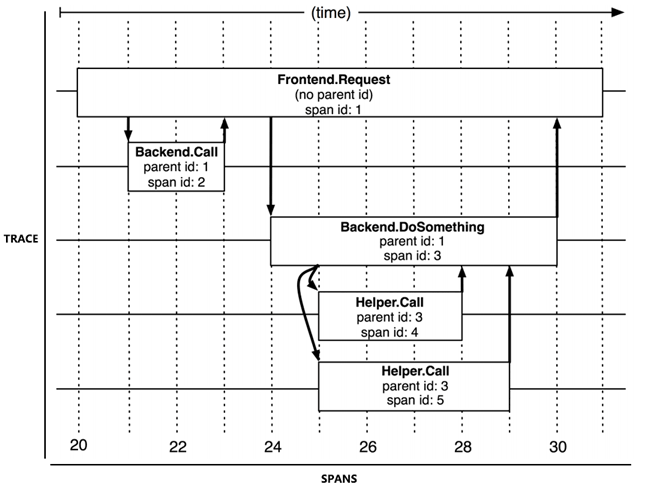

# 分布式的基石

## 一. 分布式共识算法

**可靠性**

**可用性**

以同步为代表的数据复制方法，被称为**状态转移**（State Transfer）

考虑到分布式环境下网络分区现象是不可能消除的, 我们需要设计出一种算法，能够让分布式系统内部暂时容忍存在不同的状态，但最终能够保证大多数节点的状态达成一致

CA

### Paxos(Basic Paxos)

基于消息传递的协商共识算法, 虚构了一个名为“Paxos”的希腊城邦, 民主制度. 

目标就是让城邦能够在每一位居民都不承诺一定会及时参与的情况下，依然可以按照少数服从多数的原则，最终达成一致意见。

不考虑[拜占庭将军](https://en.wikipedia.org/wiki/Byzantine_fault)问题，即假设信息可能丢失也可能延迟，但不会被错误传递

**分布式系统中的节点:**

- proposer: 提案节点

  提出提案, 设置某个值(log), 值一旦设置成功，就是不会丢失也不可变的.

- Acceptor: 决策节点

  可以对提案进行投票, 是否接受. 超过半数, 即被 accepet

- Learner: 记录节点

  学习达成共识的天.

所有的节点都是平等的，它们都可以承担以上某一种或者多种的角色.

**要解决的问题:**

- 节点通信是不可靠
- 访问时并发的, 串行访问才能被正确读写. 所以需要锁

**两个阶段:**

- Prepare: 抢占锁

  带上全局唯一数字n, 做提案ID

  acceptor提供承诺:

  - 不再接收ID <= n的prepare请求
  - 不再接受ID < n的accept请求
  - 

- 

### Multi Paxos

Multi Paxos 对 Basic Paxos 的核心改进是增加了“选主”的过程

每个主有自己的任期, 二元组变成3元组.

### Gossip 协议

比特币网络和许多重要分布式框架中都有应用的另一种具有代表性的“最终一致性”的分布式共识协议：Gossip 协议。

Gossip 也称作是“共识协议”

它所解决的问题并不是直接与 Paxos、Raft 这些共识算法等价的，只是基于 Gossip 之上可以通过某些方法去实现与 Paxos、Raft 相类似的目标而已

**两个步骤的简单循环:**

- 如果有某一项信息需要在整个网络中所有节点中传播，那从信息源开始，选择一个固定的传播周期（譬如 1 秒），随机选择它相连接的 k 个节点（称为 Fan-Out）来传播消息。
- 每一个节点收到消息后，如果这个消息是它之前没有收到过的，将在下一个周期内，选择除了发送消息给它的那个节点外的其他相邻 k 个节点发送相同的消息，直到最终网络中所有节点都收到了消息，尽管这个过程需要一定时间，但是理论上最终网络的所有节点都会拥有相同的消息。

- 能够容忍网络上节点的随意地增加或者减少，随意地宕机或者重启
- 但是: 消息最终是通过多个轮次的散播而到达全网的，因此它必然会存在全网各节点状态不一致的情况，而且由于是随机选取发送消息的节点

达到一致性耗费的时间与网络传播中消息冗余量这两个缺点存在一定对立

## 二. 从类库到服务

微服务架构其中一个重要设计原则是“通过服务来实现独立自治的组件”（Componentization via Services）, 应采用“服务”（Service）而不再是“类库”（Library）来构建组件化的程序.

两者的差别在于类库是在编译期静态链接到程序中的，通过调用本地方法来使用其中的功能，而服务是进程外组件，通过调用远程方法来使用其中的功能.

软件系统“整体”与“部分”在物理层面的真正隔离, 但是微服务架构在复杂性与执行性能方面做出了极大的让步

每个节点都是消费者和生产者, 三个问题是必须考虑并得到妥善解决的：

- **服务发现:**对消费者来说，外部的服务由谁提供？具体在什么网络位置？
- **服务的路由网关:** 对生产者来说，内部哪些服务需要暴露？哪些应当隐藏？应当以何种形式暴露服务？以什么规则在集群中分配请求？
- **服务的负载均衡:** 对调用过程来说，如何保证每个远程服务都接收到相对平均的流量，获得尽可能高的服务质量与可靠性？

### 服务发现

与编译链接有着等同意义

远程服务使用 `全限定名(full qualified domain name)`, `端口号`, `服务标识` 三元组, 来精确定位远程服务.

- 全限定名(full qualified domain name): 网络中某台主机的精确位置
- 端口: tcp/udp的网络服务
- 服务标识: 程序提供的具体方法的入口. 由具体的应用层协议确定.

**“服务发现”具体是指进行过什么操作:** CAP

1. 服务的注册(Service Registration)

2. 服务的维护(service maintain)
3. 服务的发现(service discovery): 找到服务实际的坐标

Eureka 的选择是优先保证高可用性，相对牺牲系统中服务状态的一致性

Consul 的选择是优先保证高可靠性，相对牺牲系统服务发现的可用性, 使用Raft算法, 多数节点写入成功后, 服务注册/变动才算完成. 同时采用Gossip协议, 支持多数据中心的大规模服务同步

**实现注册中心:**

- 在分布式k/v框架上开发, 比如zookeeper, doozerd, etcd
- 以基础设施（主要是指 DNS 服务器）来实现服务发现，这类的代表是 SkyDNS、CoreDNS。

- 专门用于服务发现的框架和工具，这类的代表是 Eureka、Consul 和 Nacos。

  自己决定是CP/AP

### 网关路由

> 网关 = 路由器（基础职能） + 过滤器（可选职能）

服务网关默认都必须支持七层路由，通常就默认无法直接进行流量转发，只能采用代理模式。

网关的另一个主要关注点是它的性能与可用性

**网络I/O模型:**

- 异步IO
- 同步IO
  - 阻塞IO blocking
  - 非阻塞 non-blocking
  - 多路复用 multiplexing
  - 信号驱动 signal-driven

**BFF网关:**

网关不必为所有的前端提供无差别的服务，而是应该针对不同的前端，聚合不同的服务，提供不同的接口和网络访问协议支持. 与 Web 网关有完全不同的技术选型，能提供出基于更高性能协议（如 gRPC）的接口来获得更好的体验

### 客户端负载均衡> 没看太懂

**客户端负载均衡器:** Client-Side Load Balancer

**服务端负载均衡器:** Server-Side Load Balancer

## 三. 流量治理

为了防止服务挂掉后影响, 快速发现, 快速重启. 来做容错性.

### 服务容错 fault-tolerant

**容错策略:**

- Failover 故障转移
- Failfast 快速失败

- forking 并行调用
- ...

**容错设计模式:**

- 断路器模式:

  断路器会持续监控并统计服务返回的成功、失败、超时、拒绝等各种结果，当出现故障（失败、超时、拒绝）的次数达到断路器的阈值时，它状态就自动变为“OPEN”，后续此断路器代理的远程访问都将直接返回调用失败

- 舱壁隔离模式:

  每个服务单独设立线程池

- 重试模式:

  

### 流量控制

突发的流量

**流量统计指标:**

1. TPS Transaction
2. HPS hit
3. QPS query

**限流设计模式:**

1. 流量计数器模式
2. 滑动窗口
3. 漏铜模式
4. 令牌桶模式

**分布式限流:**

> 均衡性能和准确性:

- 均分
- 共享缓存

### 

## 四. 可靠通讯

微服务讲究分散治理(Decentralized Governance), 安全漏洞的概率高了很多.

打破一些传统的安全观念，以构筑更加可靠的服务间通信机制。

### 零信任网络

**基于边界的安全模型**: Perimeter-Based Security Model

主流的网络安全观念提倡根据某类与宿主机相关的特征, 如果IP, 机房. 将安全防护措施集中部署在各个区域的边界.

比如VPN, 防火墙, 内外网概念, 都属于

**零信任安全模型:** Zero-Trust Security Model

- **零信任网络不等同于放弃在边界上的保护设施**
- 身份只来源于服务, 而不基于IP什么的
- 服务之间也没有固有的信任关系
- 集中、共享的安全策略实施点
- 受信的机器运行来源已知的代码
- 自动化、标准化的变更管理
- 

### 服务安全 todo

**建立信任:**

**认证:**

**授权:**

## 五. 可观测性

Observability: 可观测性分解为三个更具体方向进行研究

- 事件日志: Events Logging
- 链路追踪: Tracing request scoped
  - 微服务时代，追踪就不只局限于调用栈了
- Metrics aggregatable
  - 统计聚合

### 事件日志 

从打印日志到分析查询之间，还隔着收集、缓冲、聚合、加工、索引、存储等若干个步骤

### 链路追踪

完整的分布式追踪系统应该由数据收集、数据存储和数据展示三个相对独立的子系统构成，而狭义上讲的追踪则就只是特指链路追踪数据的收集部分.

**追踪(Trace)与跨度(span)**

Trace: 流经的每一个服务，直到到向客户端返回响应为止

Span: 每次开始调用服务前都要先埋入调用记录，这个记录称为一个“跨度”, 例如id

系统对外提供服务的过程中，持续地接受请求并处理响应，同时持续地生成 Trace，按次序整理好 Trace 中每一个 Span 所记录的调用关系，便能绘制出一幅系统的服务调用拓扑图。

**数据收集:**

- Log-Based Tracing:
  - 对性能影响比较低
  - 日志不保证连续与一致
- Service-Based Tracing
  - 最常见的
  - 侵入性, 资源更多
  - 稳定性+精准性更好
- Sidecar-Based Tracing
  - 最理想, 对应用完全透明
  - 有自己独立的数据通道，追踪数据通过控制平面进行上报

**追踪规范化:**

### Metrics 聚合度量

包括三个组件, 以Prometheus为例

**指标收集:**

按照指标的类型来设计收集, 

- counter
- gauge
- ......

**存储查询:**

时序数据库(time series database), 只追加

- LSM vs B+Tree

**监控预警:**

