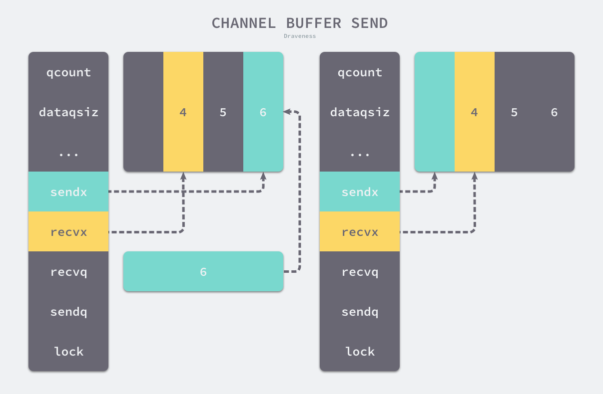
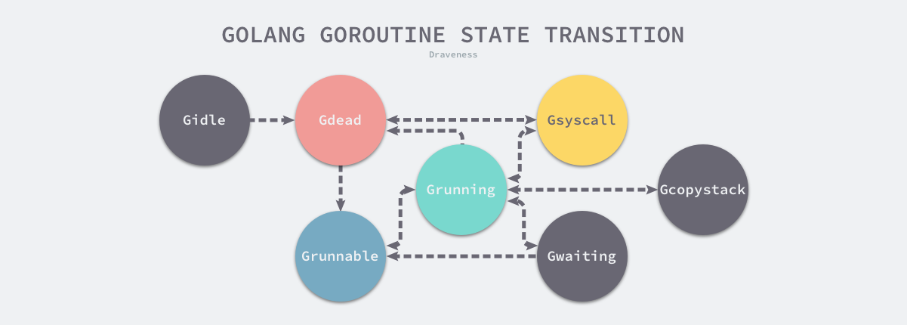
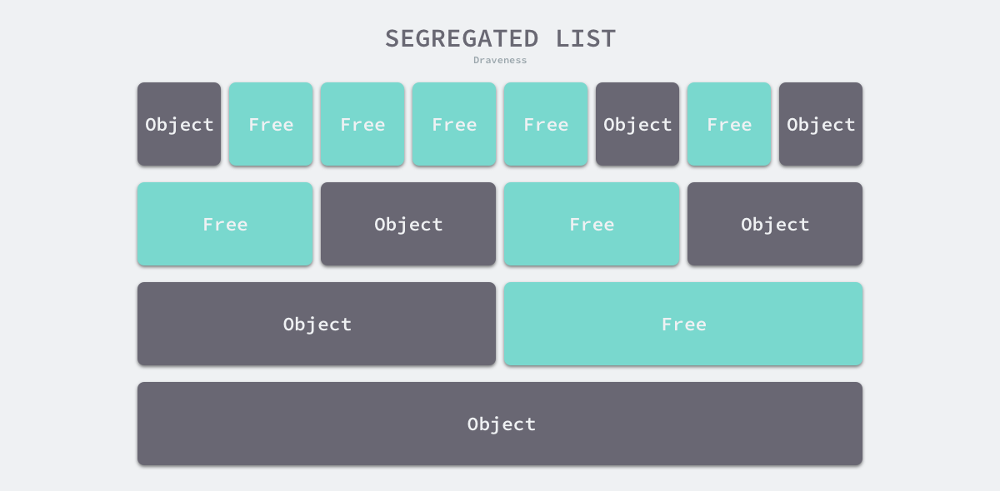

### Timer
https://blog.gopheracademy.com/advent-2016/go-timers/


### Channel

不要通过共享内存的方式进行通信，而是应该通过通信的方式共享内存

**Do not communicate by sharing memory; instead, share memory by communicating**

先入先出原则

无锁 Channel 的实现方案: 不符合先如先出原则, 暂时没有选用

结构体: [`runtime.hchan`](https://draveness.me/golang/tree/runtime.hchan)

- `make(chan struct{})`语句经过类型检查会在ssa中间代码调用[`runtime.makechan`](https://draveness.me/golang/tree/runtime.makechan64) 函数

- `ch <- i`发送, 编译后转成 [`runtime.chansend1`](https://draveness.me/golang/tree/runtime.chansend1)
  - 当存在等待的接收者时，通过 [`runtime.send`](https://draveness.me/golang/tree/runtime.send) 直接将数据发送给阻塞的接收者；
    - 将接收方的 Goroutine 放到了处理器的 `runnext`
    - 
  - 当缓冲区存在空余空间时，将发送的数据写入 Channel 的缓冲区；
    - 通过在buf中, 环形buf, sendx位置写入, qcount计数增加
    - 
  - 当不存在缓冲区或者缓冲区已满时，等待其他 Goroutine 从 Channel 接收数据；
    - 加入发送等待队列,  陷入沉睡
- close(chan) 
  - 把阻塞的goroutine唤醒
  - 把数据都pop出去


### Processor 调度器

线程比较轻量, 大概1M的内存, 上下文切换大概1us

go的goroutine上下文切换在0.2us

**设计进化**

1. G-M: 一个线程, 执行一个goroutine
2. 允许多线程, 竞争同一个任务对垒
3. **G-M-P**: 
   - **p工作窃取**
   - goroutine只会主动让出,才能给到p运行下一个, 造成饥饿\影响GC'
   - 
   - Processor 将线程绑定在一个独立的cpu
4. **p抢占式**
   - 1.2- 基于协作的抢占
     - Goroutine 运行超过 10ms 时发出抢占请求
     - 编译器会在调用函数前插入 [`runtime.morestack`](https://draveness.me/golang/tree/runtime.morestack), 增加了运行时的复杂度，但是实现相对简单
   - 1.14-基于信号的抢占
     - 函数启动, `SIGURG` 信号的处理函数, 在各个节点, 发出抢占信号.

5. 非均匀存储访问调度器(提案)


G: 任务, 运行时调度器中的地位与线程在操作系统中差不多，但是它占用了更小的内存空间，也降低了上下文切换的开销



M: 操作系统线程, 最多有10000个, 每个p拿着一个, 也就是最多只有p个在运行.

```go
type m struct {
	g0   *g // 持有调度栈的 Goroutine, 参与g的调度\创建\内存分配
	curg *g // 当前在运行的
	...
}
```

P:

1. [`runtime.schedinit`](https://draveness.me/golang/tree/runtime.schedinit) 初始化调度器


### 网络轮询器

利用了操作系统提供的 I/O 多路复用模型来提升 I/O 设备的利用率以及程序的性能

**常见的几种 I/O 模型:**

> 在unix系统中, IO 模型会使用不同的方式操作文件描述符

1. 阻塞IO: 从用户态陷入内核态, 阻塞

2. 非阻塞: 不在内核态阻塞, 需要不停进入内核态查看是否ready

3. IO多路复用: 

   1. select 监听最多 1024 个文件描述符的可读或者可写状态, 时间复杂度 𝑂(𝑛)
   2. Poll: 链表存储文件描述符，摆脱了 1024 的数量上限
   3. 不同才做系统有自己的实现: epoll, kqueue, evport

   

**Go是用的IO多路复用:**

- 使用平台特定的函数实现了多个版本的网络轮询模块

  `netpoll_epoll.go`, `netpoll_kqueue.go`...

- **网络轮询器实际上是对 I/O 多路复用技术的封装**

- 使用过程:
  1. 网络轮询器的初始化；
  2. 如何向网络轮询器加入待监控的任务；
  3. 如何从网络轮询器获取触发的事件；
- 运行时的调度器和系统调用都会通过 [`runtime.netpoll`](https://draveness.me/golang/tree/runtime.netpoll) 与网络轮询器交换消息，获取待执行的 Goroutine 列表，并将待执行的 Goroutine 加入运行队列等待处理。
- 所有的文件 I/O、网络 I/O 和计时器都是由网络轮询器管理的

> 没看太懂


### 系统监控

守护进程, 每隔一段时间检查 Go 语言运行时，确保程序没有进入异常状态。

它在内部启动了一个不会中止的循环，在循环的内部会轮询网络、抢占长期运行或者处于系统调用的 Goroutine 以及触发垃圾回收

**系统监控线程如何启动:???**

**系统监控的工作:**

1. 运行计时器 — 获取下一个需要被触发的计时器；
2. 轮询网络 — 获取需要处理的到期文件描述符；
3. 抢占处理器 — 抢占运行时间较长的或者处于系统调用的 Goroutine；
4. 垃圾回收 — 在满足条件时触发垃圾收集回收内存；


## 7 内存管理

**栈区（Stack）**

- 函数调用的参数、返回值以及局部变量
- 编译器管理

**堆区（Heap）**

- 编译器+写代码的人管理
- GC回收

**内存管理:**

- mutator 用户程序
- allocator 分配器
- collector 收集器


**分配方法:**

- 线性分配 sequential allocator

  释放的内存, 需要移动对象才能利用

  - 所以, 需要搭配合适GC算法, Mark-Compack(标记压缩), Copying GC, GenerationalGC分代回收
  - 所以, C和C++直接对外暴露指针的语言,无法使用

- 空闲链表分配 free-list allocator

  分配需要遍历链表, 时间复杂度O(n), 不同策略来选择内存: First-Fitx, Next-Fit, Beast-Fit...

  Go使用Segregated-Fit(隔离适合), 将内存分割成4\8\16\32字节内存块,组成的链表

  


